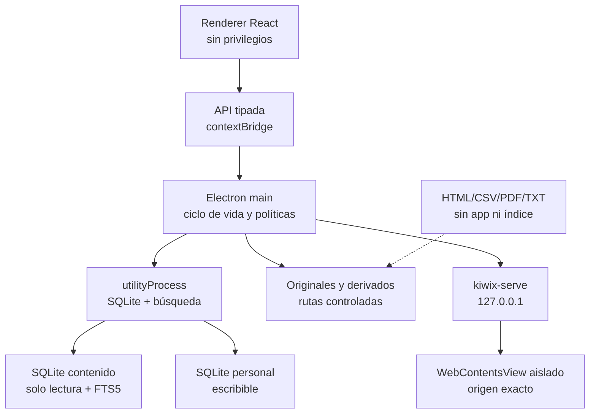
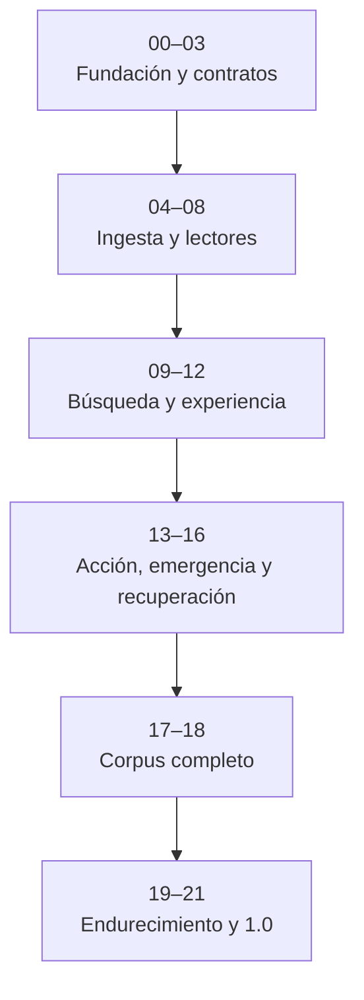

# VESTIGIO — Plan maestro de producto y ejecución

**Lema:** El conocimiento que permanece  
**Versión del plan:** 2.0 — auditoría técnica, editorial y de uso integrada  
**Estado del documento:** decisiones cerradas; no iniciar construcción con una versión anterior  
**Fecha de referencia:** 30 de julio de 2026  
**Propietario y usuario:** una sola persona  
**Repositorio previsto:** `larabiatendra-prog/vestigio` público; alternativa `larabiatendra-prog/vestigio-offline` si el nombre no está disponible; privado únicamente si GitHub impide crear uno público.

---

## Índice operativo

1. [Cómo usar este documento](#1-cómo-usar-este-documento)
2. [Definición del producto](#2-definición-del-producto)
3. [Decisiones definitivas](#3-decisiones-definitivas)
4. [Criterio de producto terminado](#4-criterio-de-producto-terminado)
5. [Experiencia y arquitectura de información](#5-experiencia-y-arquitectura-de-información)
6. [Arquitectura técnica](#6-arquitectura-técnica)
7. [Estructura portable de la entrega](#7-estructura-portable-de-la-entrega)
8. [Modelo de datos](#8-modelo-de-datos)
9. [Búsqueda offline](#9-búsqueda-offline)
10. [Política editorial y de fuentes](#10-política-editorial-y-de-fuentes)
11. [Corpus inicial y matriz de cobertura](#11-corpus-inicial-y-matriz-de-cobertura)
12. [Aprender, aplicar y emergencia](#12-aprender-aplicar-y-emergencia)
13. [Seguridad, privacidad, integridad y recuperación](#13-seguridad-privacidad-integridad-y-recuperación)
14. [Rendimiento, accesibilidad y pruebas](#14-rendimiento-accesibilidad-y-pruebas)
15. [Repositorio, licencias y documentación](#15-repositorio-licencias-y-documentación)
16. [Mapa completo de ejecución](#16-mapa-completo-de-ejecución)
17. [Protocolo obligatorio para Claude Code](#17-protocolo-obligatorio-para-claude-code)
18. [Prompts secuenciales para Claude Code](#18-prompts-secuenciales-para-claude-code)
19. [Lista final de aceptación](#19-lista-final-de-aceptación)
20. [Fuentes técnicas y documentales de referencia](#20-fuentes-técnicas-y-documentales-de-referencia)

---

## 1. Cómo usar este documento

Este archivo es la especificación maestra. Debe guardarse en la raíz del repositorio como `PLAN_MAESTRO.md`. Claude Code debe recibir primero el **Prompt de arranque** y después un solo bloque de ejecución cada vez, en el orden indicado.

Reglas:

1. No entregar todos los bloques a Claude Code de una vez.
2. No comenzar un bloque si el anterior no ha superado sus criterios de salida.
3. Al terminar cada bloque, Claude Code debe:
   - ejecutar todas las comprobaciones exigidas;
   - presentar un resumen de cambios;
   - listar pruebas y sus resultados reales;
   - declarar cualquier desviación o deuda;
   - actualizar `PROJECT_STATE.md` y la trazabilidad;
   - dejar un commit pequeño, coherente y recuperable;
   - detenerse y esperar el siguiente bloque.
4. Una prueba fallida no se convierte en “pendiente” para poder avanzar. Se corrige o se documenta un bloqueo real.
5. Las decisiones de este plan no deben sustituirse silenciosamente. Cualquier cambio de arquitectura exige un ADR nuevo, evidencia y aprobación del propietario.
6. Se permite Internet durante construcción y curación. La aplicación final y sus pruebas de aceptación deben funcionar con Internet deshabilitado.
7. No hay una fase “MVP” ni un prototipo que se presente como producto. Sí hay verificaciones técnicas tempranas y una sucesión de incrementos integrados, pero el único hito publicable es una versión sólida que cumpla la definición de terminado.

### 1.1 Resultado de la auditoría 2.0

El concepto y la pila principal se mantienen. Electron, React, TypeScript, SQLite FTS5, PDF.js y Kiwix siguen siendo decisiones válidas para este producto. La auditoría añade los siguientes requisitos porque eliminan puntos de fallo o promesas que la versión anterior no podía demostrar.

**P0 — bloquean el escalado del corpus**

1. El lector debe seguir ofreciendo una salida útil si fallan Electron, SQLite o Kiwix: catálogo estático, núcleo de emergencia y guía de recuperación accesibles fuera de la aplicación.
2. `Doctor.bat` debe ejecutar primero un diagnóstico independiente mediante CMD/Windows PowerShell; no puede depender únicamente de `Vestigio.exe`.
3. SQLite y la búsqueda se ejecutan en un `utilityProcess` reiniciable con lease/epoch y un único escritor; una caída nunca crea dos procesos mutando la misma base.
4. Kiwix se muestra en un `WebContentsView` aislado, sin preload ni IPC, con sesión efímera y permiso exclusivo para el origen loopback exacto que posea Vestigio.
5. La búsqueda española/valenciana preserva `ñ/n`, diacríticos y grafías propias en el índice exacto; la tolerancia a tildes, variantes, sinónimos y erratas se implementa en capas visibles y nunca corrige silenciosamente una consulta de riesgo.
6. Los hashes detectan corrupción. La autenticidad se verifica además mediante la firma offline del manifiesto; la recuperación exige otra copia válida o redundancia explícita.
7. El corpus mantiene provenance inmutable de release, custodia posterior separada, decisión jurídica humana granular, identificación/validación de formatos y masters suficientes para reconstruir derivados sin volver a Internet.
8. El núcleo crítico usa una única fuente canónica para pantalla, fallback e impresión; las piezas de riesgo se validan por claridad, fuentes y tareas reales.
9. Daniel es una puerta de aceptación de UX. Claude puede proponer y probar automáticamente, pero no autoaprobar usabilidad, encontrabilidad ni comprensión.
10. Antes de curar cientos de recursos se supera una puerta técnica vertical con paquete Windows real, SQLite nativo, FTS5, Kiwix aislado, BAT independientes, NTFS/exFAT y captura de red a nivel del sistema operativo.
11. La 1.0 congela un inventario finito de capacidades antes de curar; los checkpoints son incrementales y la Bag completa se construye una sola vez en RC, sin datos personales ni hashes autorreferentes.

**P1 — obligatorios antes de 1.0**

- Versionar por separado aplicación/runtime, corpus e Información vigente.
- Empaquetar la copia de archivo/transferencia con BagIt y mantener dos copias completas verificadas en soportes distintos.
- Registrar relaciones de sustitución, contradicción, retirada y cambios entre releases.
- Añadir filtros de viabilidad práctica: tiempo, personas, herramientas, consumibles, energía, agua, entorno, esfuerzo y experiencia.
- Ofrecer exportación personal legible en Markdown/CSV/JSON, además del backup SQLite.
- Aplicar WCAG 2.2 AA también a reflow, `forced-colors`, foco, mensajes de estado, teclado y lector de pantalla.

**P2 — endurecimiento posterior, no condición de 1.0**

- Paridad PAR2 del 5–10 % para el núcleo crítico y la copia de archivo.
- Authenticode si el binario se distribuye públicamente más allá de su uso personal.
- Exportación PREMIS/PROV interoperable, visor cartográfico, IA, RAG y demás ampliaciones ya excluidas.

Estas prioridades no crean un segundo producto ni una arquitectura institucional. Añaden resiliencia allí donde una biblioteca para escenarios adversos no puede depender de un único ejecutable, índice o soporte.

---

## 2. Definición del producto

### 2.1 Visión

Vestigio es una biblioteca técnica y práctica completamente offline para Windows. Conserva documentos originales, los vuelve localizables y los sitúa dentro de una capa editorial clara. Debe servir para:

- resolver una necesidad inmediata;
- comprender un concepto nuevo;
- recorrer un aprendizaje ordenado;
- aplicar conocimiento mediante procedimientos, proyectos y listas;
- preservar materiales útiles aunque no haya Internet;
- transportar la biblioteca, junto con las notas personales, entre discos y ordenadores.

No es una Wikipedia, no sustituye la Wikipedia local existente y no la incorpora. Tampoco es un chatbot, un RAG, un modelo local, un servidor doméstico ni una carpeta de PDF sin estructura.

### 2.2 Propósito

> Conservar el conocimiento más práctico, buscable, comprensible y aplicable para sobrevivir, aprender, construir y reconstruir materiales, servicios y tejido social en un contexto de degradación o colapso, sin dejar de resultar útil en la vida normal.

### 2.3 Usuario

- Una sola persona.
- Sin cuentas, roles, login, permisos multiusuario ni sincronización en nube.
- Datos personales locales y portables.
- La arquitectura separará código, corpus y datos personales para que el producto siga siendo transportable y publicable sin exponer información privada.

### 2.4 Principios

1. **Offline real:** ninguna función de consulta necesita red.
2. **Conocimiento antes que volumen:** entra lo útil, no lo abundante.
3. **Original conservado:** toda derivación apunta al documento original.
4. **Confianza legible:** autoridad, antigüedad, consenso y trazabilidad se muestran por separado.
5. **Peligro contextualizado:** un tema no se excluye por resultar incómodo; sí se explica su riesgo, legalidad, límites y contexto.
6. **Austeridad resistente:** pocas piezas, formatos duraderos, estado recuperable y comportamiento predecible.
7. **Búsqueda tradicional excelente:** filtros, categorías, etiquetas, fecha, geografía y texto completo; sin IA.
8. **Acción y aprendizaje:** encontrar no basta; el producto ayuda a entender y hacer.
9. **Corpus cerrado en lectura:** la aplicación de consulta no modifica la biblioteca maestra.
10. **Reproducibilidad:** índices y derivados se pueden reconstruir a partir de originales y manifiestos.
11. **Degradación útil:** si fallan la aplicación, el índice o Kiwix, todavía se pueden localizar y abrir el catálogo, los originales y el núcleo de emergencia.
12. **Recuperación honesta:** un hash detecta; una firma autentica; solo otra copia o redundancia suficiente permite recuperar.

### 2.5 Fuera de alcance de la versión 1.0

- IA local, chatbot, RAG, embeddings, búsqueda semántica o generación en tiempo de uso.
- Wikipedia en español u otras Wikipedias.
- Aplicaciones móviles, macOS, Linux o Raspberry Pi.
- Servidor LAN, acceso remoto, cuentas o colaboración.
- Sincronización automática, telemetría o actualizador conectado.
- Edición del catálogo desde la aplicación lectora.
- OCR masivo.
- Traducción automática masiva.
- Vídeo como parte normal del corpus.
- Enrutamiento GPS o visor cartográfico interactivo. Sí se admitirán mapas oficiales en formatos documentales; un módulo cartográfico interactivo quedará para una versión posterior.
- Resaltado libre universal sobre cualquier formato. La versión 1.0 tendrá marcadores y notas ancladas a página, sección o recurso.
- Cifrado propio. Si se necesita protección del soporte completo se documentará el uso de BitLocker To Go o VeraCrypt, sin inventar un sistema criptográfico dentro de Vestigio.

---

## 3. Decisiones definitivas

| Área | Decisión |
|---|---|
| Nombre | **Vestigio**; lema **El conocimiento que permanece**. Antes de 1.0 se realizará una comprobación básica de nombre y marcas. |
| Alcance de uso | Personal, un solo usuario. |
| Repositorio | GitHub bajo `larabiatendra-prog`; público si GitHub lo permite. |
| Plataforma | Windows 11 x64; compatible con portátil modesto de 8 GB de RAM, sin GPU y 1366 × 768. |
| Portabilidad | Carpeta autocontenida, arrancable desde USB sin permisos de administrador ni instalación previa. |
| Scripts | `Install.bat`, `Doctor.bat` y `Start.bat` en la raíz. |
| Tecnología | Electron + React + TypeScript; Electron Forge con plugin Webpack estable; runtime incluido. |
| Procesos | Renderer sin privilegios; main para ciclo de vida/políticas; SQLite y búsqueda en un `utilityProcess` reiniciable; Kiwix como proceso separado. |
| Persistencia | SQLite; catálogo/índice inmutable separado de la base personal escribible. |
| Escritura personal | Rollback journal `DELETE` y `synchronous=EXTRA` como base; cualquier alternativa exige evidencia en NTFS y exFAT. Backup con API SQLite y cierre seguro antes de expulsar/copiar. |
| ZIM | Kiwix ligado a `127.0.0.1`, con `--blockexternal`, ciclo de vida unido a Vestigio y visor `WebContentsView` aislado por origen exacto. |
| PDF | PDF.js fijado, sandboxed, con worker real, scripting/acciones externas desactivadas, límites de recursos y vista textual derivada. |
| EPUB | Original preservado; validación con EPUBCheck y lectura normalizada a HTML saneado, sin scripts ni recursos externos. |
| HTML/Markdown/TXT | Conversión y saneado durante construcción; renderizado local. |
| Búsqueda | SQLite FTS5 + Kiwix; índice exacto y capa tolerante española que preserva `ñ`; combinación determinista, sin IA. |
| Internet en ejecución | Bloqueado por diseño; únicamente protocolos internos y el Kiwix local. |
| Catálogo | Cerrado en el lector; herramientas de administración separadas. |
| Corpus | Predominio español; prioridad geográfica Valencia → España → Europa → mundo. |
| Traducción | Metadatos y resúmenes en español para todo; traducción integral solo cuando el valor lo justifique y siempre marcada. |
| OCR | Selectivo para recursos únicos y valiosos; nunca por defecto ni en lote indiscriminado. |
| Versiones | `app_version`, `corpus_version` y `current_info_version` independientes. Actualizaciones manuales y marginales; excepción necesaria para vulnerabilidad crítica o runtime sin soporte. |
| Datos personales | Favoritos, colecciones, notas, marcadores, progreso y listas viajan en la carpeta; backup SQLite más exportación legible Markdown/CSV/JSON. |
| Modos | Biblioteca, Aprender, Aplicar y Emergencia; “Información vigente” separado y fechado; fallback estático fuera de la app. |
| Integridad/autenticidad | SHA-256 para fixity; manifiesto superior firmado offline con Minisign/Ed25519; clave privada siempre fuera del repo y de la entrega. |
| Preservación | Originales/masters, derivados y eventos trazables; copia de trabajo y dos copias completas verificadas en soportes distintos. BagIt para archivo/transferencia. |
| Diseño | Sobrio, amable, monumental y orgánico; piedra, musgo, luz y silencio como referencias abstractas, sin copiar elementos de *Shadow of the Colossus*. |
| Licencia del código | Apache-2.0. Solo los campos editoriales realmente originales se publicarán bajo CC BY 4.0. Cada asset, extracto y derivado conserva su base de derechos. |
| Distribución del corpus | La edición personal puede contener recursos adquiridos y conservados bajo una base documentada aplicable a ese uso. El repositorio público no incluirá assets/campos cuya redistribución no esté permitida y auditada. |

### 3.1 Decisiones tomadas para resolver los “como veas”

- Habrá una interfaz de Emergencia realmente simplificada, no solo enlaces rápidos.
- Habrá además un núcleo estático firmado y un catálogo HTML/CSV legible sin Electron, SQLite ni Kiwix.
- Habrá notas por recurso, página o sección; no resaltado universal en 1.0.
- Habrá procedimientos paso a paso y checklists reutilizables.
- La 1.0 incluirá cuatro piezas imprimibles propias: arranque/reparación, lista de 72 horas, agua/saneamiento y plan personal de emergencia. Todas se generan desde datos canónicos compartidos con la interfaz, están citadas y tienen fecha de revisión.
- No habrá “ediciones ligeras” como productos distintos en 1.0. El corpus estará modularizado para copiar módulos en el futuro, pero solo se validará y publicará una edición personal completa.
- Los originales serán tratados como inmutables. Solo la herramienta administrativa podrá construir una nueva edición.
- Los IDs son UUID opacos e inmutables; los slugs y nombres legibles son aliases modificables, nunca claves de identidad.
- Se podrá utilizar automatización durante la construcción para extracción, detección de duplicados y propuestas de etiquetas. Ninguna salida automática se publicará sin validación determinista o revisión humana. No se usará IA como dependencia ni como árbitro editorial.
- Se conservarán documentos históricos solo si su utilidad es singular y su estado histórico es visible. Se rechazarán escaneos deficientes si existe una alternativa legible.
- No se generarán guías editoriales largas en masa. Las guías propias serán pocas, de alta utilidad, citadas y mantenibles.

---

## 4. Criterio de producto terminado

Vestigio 1.0 está terminado solo cuando cumple simultáneamente:

### 4.1 Producto

- Se abre desde una carpeta copiada a un disco USB, sin administrador y sin software instalado previamente.
- `Start.bat` verifica primero el bootstrap, inicia la aplicación solo si pasa y evita instancias duplicadas.
- `EMERGENCIA.bat` abre el núcleo crítico o su fallback en doble clic.
- `Install.bat` no descarga nada: prueba primero si puede escribir, selecciona modo y solo entonces crea las carpetas personales si procede y ejecuta el diagnóstico inicial.
- `Doctor.bat` verifica primero estructura, firma, archivos críticos, espacio y permisos sin ejecutar `Vestigio.exe`; después ofrece el diagnóstico profundo si la aplicación está sana.
- Funciona correctamente sin conexión y no intenta conexiones externas.
- `FALLBACK/CATALOGO.html`, `CATALOGO.csv`, el núcleo estático de Emergencia y la guía TXT/PDF siguen siendo utilizables aunque se rompan la aplicación, el índice y Kiwix.
- Busca, filtra, abre y navega todos los formatos admitidos.
- Las notas, favoritos, colecciones y progreso sobreviven al cierre, al cambio de letra de unidad y a una actualización manual.
- “Cerrar y preparar para copiar/expulsar” termina escrituras, crea un snapshot coherente, cierra SQLite/Kiwix y confirma cuándo ya no hay archivos abiertos por Vestigio.
- Una corrupción simulada de los índices se recupera sin perder originales ni datos personales.
- Una corrupción simulada de los datos personales activa recuperación desde copia, sin reemplazos silenciosos.
- La documentación no promete recuperar un soporte perdido o físicamente dañado sin otra copia válida.

### 4.2 Contenido

- Existe una matriz finita `capabilities-1.0.yml` aprobada y no quedan huecos críticos.
- Todos los módulos obligatorios tienen recursos introductorios, aplicados y técnicos cuando el tema lo requiere.
- Cada recurso tiene procedencia, licencia o base de conservación, fecha, idioma, geografía, dificultad, riesgos y evaluación separada de confianza.
- Todo recurso en idioma extranjero tiene al menos título, resumen, etiquetas y nota de aplicabilidad en español.
- Los documentos de alto riesgo tienen advertencias visibles y no se presentan como equivalentes a atención profesional.
- “Información vigente” muestra fecha de verificación y caducidad editorial.
- No hay recursos rotos, duplicados injustificados, archivos sin catalogar ni bases de derechos/evidencias desconocidas tratadas como abiertas.
- Las capacidades críticas se demuestran con escenarios y puntos concretos de acceso; la mera presencia de un documento o ZIM no cuenta como cobertura.
- La 1.0 no incluye procedimientos críticos propios: conserva protocolos oficiales sin recomposición, con derechos, versión, localizadores y exactitud comprobados.

### 4.3 Ingeniería

- Repositorio reproducible desde una máquina limpia siguiendo la documentación.
- La reproducibilidad se declara por separado: aplicación desde repo; corpus desde masters preservados; readquisición de Internet solo como *best effort*.
- Dependencias bloqueadas con lockfile y licencias inventariadas.
- Pruebas unitarias, de integración y end-to-end superadas.
- Build de Windows realizado por CI y validado manualmente en NODO, equipo objetivo modesto y Windows/VM limpia sin Node ni redistribuibles adicionales.
- Paquete final con manifiesto SHA-256 firmado, inventario de componentes, SBOM, tres versiones independientes y notas de versión.
- Copia de archivo/transferencia BagIt válida, sin datos mutables ni autorreferencia, y dos copias completas verificadas en soportes físicos distintos, una normalmente desconectada.
- Cero errores críticos o altos conocidos; cualquier deuda menor tiene impacto y solución documentados.
- Guía de usuario, guía de curación, guía de recuperación y hoja imprimible offline completas.

---

## 5. Experiencia y arquitectura de información

### 5.1 Navegación principal

1. **Inicio**
   - búsqueda prominente;
   - continuar leyendo/aprendiendo;
   - favoritos recientes;
   - accesos a módulos;
   - entrada clara a Emergencia;
   - estado de integridad y versión, sin ruido si todo está bien.
2. **Biblioteca**
   - listado y rejilla;
   - filtros combinables;
   - categorías, etiquetas y colecciones;
   - detalle editorial del recurso;
   - lector integrado.
3. **Aprender**
   - rutas ordenadas;
   - objetivos y prerrequisitos;
   - progreso por unidad;
   - prácticas sugeridas.
4. **Aplicar**
   - procedimientos;
   - proyectos;
   - materiales y herramientas;
   - listas reutilizables;
   - impresión.
5. **Información vigente** — acceso secundario, visible cuando una búsqueda o recurso lo necesite
   - fichas reemplazables;
   - jurisdicción;
   - última verificación;
   - alerta si están vencidas.
6. **Emergencia**
   - interfaz de estrés;
   - letra grande, alto contraste y navegación mínima;
   - entrada primaria por peligro: médica, fuego/humo, DANA/inundación, gas/electricidad, falta de agua, apagón, refugio o evacuación;
   - dentro de cada situación: acción inmediata, primeras horas y preparación de 72 horas;
   - acceso por teclado;
   - impresión rápida.
7. **Mi espacio**
   - favoritos;
   - colecciones;
   - notas y marcadores;
   - progreso;
   - exportación/importación;
   - preferencias.
8. **Sistema**
   - versión de aplicación, corpus e Información vigente;
   - diagnóstico;
   - integridad;
   - copias de seguridad;
   - documentación offline.

La navegación primaria visible será **Inicio, Biblioteca, Aprender y Aplicar**. Emergencia permanece siempre accesible como acción global. Información vigente, Mi espacio y Sistema son destinos secundarios para evitar una barra principal saturada.

### 5.2 Filtros combinables

- módulo y categoría;
- etiquetas;
- geografía;
- idioma;
- formato;
- dificultad;
- autoridad;
- estado de vigencia;
- consenso;
- riesgo;
- tipo de uso: consultar, aprender, aplicar, emergencia;
- fecha de publicación;
- fecha de revisión;
- tiempo disponible;
- número de personas;
- herramientas y consumibles disponibles;
- necesidades de energía y agua;
- entorno: interior, exterior, urbano, rural o taller;
- esfuerzo físico y experiencia práctica;
- solo favoritos, con notas o pendientes.

Reglas:

- `OR` dentro de una misma faceta y `AND` entre facetas;
- recuentos calculados sobre el conjunto ya filtrado;
- valor visible “sin clasificar” cuando falte metadata;
- filtros no aplicables a un resultado ZIM no se fingirán: se deshabilitan o se explica que la evaluación corresponde a la colección;
- los chips anuncian su acción completa, por ejemplo “Quitar filtro: Valencia”;
- “Limpiar todo” es evidente;
- al volver desde un recurso se restauran consulta, filtros, scroll y foco.

### 5.3 Ficha de recurso

Debe separar:

- qué es;
- para qué sirve;
- qué aprenderá o podrá hacer el usuario;
- nivel y conocimientos previos;
- viabilidad: tiempo, personas, herramientas, consumibles, energía/agua, entorno y esfuerzo;
- autoridad de la fuente;
- fecha y estado de vigencia;
- consenso;
- trazabilidad;
- ámbito geográfico;
- riesgos y advertencias;
- versión original, idioma, formato, tamaño y licencia;
- estado del recurso: vigente, necesita revisión, sustituido, retirado o histórico;
- índice del documento;
- recursos relacionados;
- rutas y procedimientos que lo utilizan;
- abrir original;
- añadir favorito, colección, marcador o nota.

### 5.4 Principios de interfaz

- La función domina sobre la decoración.
- Ningún texto crítico depende solo de color o iconos.
- Contraste WCAG AA como mínimo.
- Interfaz usable por teclado; reflow hasta 400 % o 320 CSS px sin doble desplazamiento, salvo excepciones justificadas como tablas complejas o lienzo PDF.
- Tipografía base no inferior a 16 px en lector; Emergencia no inferior a 18 px.
- Compatibilidad con `forced-colors` de Windows, espaciado de texto WCAG y escalas del sistema de 125, 150 y 200 %.
- Objetivos mínimos de 24 × 24 CSS px; en Emergencia, 44 × 44.
- Foco visible y nunca oculto; mensajes de estado accesibles para búsqueda, guardado, impresión y recuperación.
- Evitar scroll anidado y virtualización de listas por defecto; si el volumen obliga, demostrar accesibilidad con lector de pantalla.
- Estados vacíos explicativos, mensajes de error accionables y sin códigos crípticos.
- Animación reducida y prescindible.
- Sin carruseles automáticos, anuncios, recomendaciones opacas ni estímulos innecesarios.
- La estética “Vestigio” se expresa con materiales, escala, luz y color; no con ornamento que ralentice o distraiga.

---

## 6. Arquitectura técnica

### 6.1 Vista general



### 6.2 Componentes

#### Aplicación lectora

- Electron, React y TypeScript.
- Webpack mediante el plugin estable de Electron Forge. No usar el plugin Vite mientras su documentación oficial lo considere experimental y sin garantías de estabilidad de API.
- Electron Forge para empaquetado, salvo que la prueba de empaquetado documente una limitación insalvable.
- Estado de UI local y explícito; evitar frameworks globales innecesarios.
- API entre renderer y proceso principal definida con tipos compartidos y validación de esquemas.

#### Proceso principal

Responsable de:

- resolución segura de rutas portables;
- lectura de archivos permitidos;
- impresión/exportación;
- arranque y cierre de Kiwix;
- bloqueo de red y navegación externa;
- creación, supervisión y reinicio acotado del servicio de búsqueda;
- coordinación de cierre seguro;
- logging rotativo sin datos sensibles.

No ejecuta consultas SQLite síncronas, extracción, indexación ni trabajo pesado que pueda congelar el ciclo de eventos.

#### Servicio de datos y búsqueda

- `utilityProcess` de Electron con contrato de mensajes tipado y validado.
- Único propietario de las conexiones SQLite.
- Búsqueda, filtros, backups consistentes, migraciones y comprobaciones de integridad.
- Límites de tiempo, tamaño de respuesta y consultas concurrentes.
- Reinicio controlado tras crash mediante supervisor con `lease/epoch`: no se crea un sucesor hasta confirmar la muerte del proceso anterior y liberar su lease. Nunca pueden coexistir dos escritores.
- Una petición que modifica datos no se reintenta automáticamente tras perder la respuesta; se consulta su estado por ID idempotente o se informa de resultado desconocido. Si el crash ocurre durante una migración, el siguiente arranque verifica/recupera y permanece en solo lectura hasta resolverla.
- Sin APIs de red. Toda comunicación pasa por `MessagePort`. Cuando una búsqueda necesita Kiwix, el proceso principal —único propietario del cliente HTTP loopback— actúa como proxy restringido al origen exacto y devuelve el resultado validado al servicio para fusionarlo.
- Las operaciones largas admiten cancelación y progreso.

#### Base de contenido

- `CONTENT/index/vestigio-content.sqlite`.
- Abierta con la opción real del backend: `readOnly: true` en `node:sqlite` o `{ readonly: true, fileMustExist: true }` en `better-sqlite3`; además `PRAGMA query_only=ON`. No se describe `mode=ro` como API universal. `immutable=1` solo cuando se demuestre que el archivo no puede sustituirse mientras la conexión permanezca abierta.
- Metadata normalizada, relaciones, segmentos y FTS5.
- Se reconstruye con la herramienta administrativa.
- Nunca recibe notas ni estado del usuario.

#### Base personal

- `USER_DATA/vestigio-user.sqlite`.
- Un solo escritor.
- `journal_mode=DELETE` y `synchronous=EXTRA` como valor de producción. `TRUNCATE` o WAL solo mediante ADR posterior con pruebas de fallo en NTFS y exFAT.
- Tras abrir cada base se leen y afirman los valores efectivos de `journal_mode`, `synchronous`, `foreign_keys`, `query_only`, `trusted_schema` y `busy_timeout`; no se presupone que un `PRAGMA` solicitado haya sido aplicado.
- Migraciones transaccionales, copia previa y rollback.
- No guarda rutas absolutas a la unidad; usa identificadores estables.
- Marca de cierre limpio. Tras cierre sucio se ejecutan comprobaciones reforzadas antes de habilitar escritura.
- Backup en caliente mediante SQLite Backup API, nunca copia directa de una base abierta. `VACUUM INTO` solo se admite con la base detenida, seguido de sincronización y verificación de la copia.

#### Kiwix

- `kiwix-serve.exe` incluido como componente de terceros.
- Se lanza con enlace explícito a `127.0.0.1`, bloqueo de recursos externos y, si la versión fijada lo soporta, unión al PID padre.
- Puerto elegido dinámicamente dentro de un rango documentado, sin asumir que una comprobación previa lo reserva.
- Secuencia `spawn → proceso vivo → health-check que identifica versión/instancia → aceptar`; si falla o el puerto pertenece a otro proceso, se cierra y reintenta de forma acotada.
- Comprobación de salud y cierre garantizado.
- Nunca expuesto a la LAN.
- Búsqueda mediante el endpoint público documentado y con test contractual de versión. La navegación de lectura fija una versión exacta y prueba también las rutas del visor que realmente use; si cambian, se degrada al lector documental o se bloquea esa actualización, no se abre una allowlist más amplia.
- Visualización en `WebContentsView`, sin preload ni IPC, `nodeIntegration=false`, sandbox, permisos/descargas/ventanas denegados y sesión efímera independiente.
- Allowlist exclusiva del origen exacto `http://127.0.0.1:<puerto-propiedad-de-Vestigio>`; no se permite todo loopback.
- Preferencia por JavaScript desactivado. Si una colección esencial lo necesita, solo se admite dentro de este contenedor aislado y tras una prueba de seguridad específica.
- La evaluación de autoridad, vigencia o consenso de una colección ZIM no se atribuye automáticamente a cada artículo.

#### Herramienta administrativa

No forma parte del uso diario. Será un conjunto de comandos TypeScript, esquemas y reportes para:

- registrar fuentes;
- descargar de forma reproducible cuando la fuente lo permita;
- calcular hashes;
- extraer texto;
- sanear HTML;
- convertir Markdown;
- generar miniaturas;
- procesar PDF/EPUB;
- ejecutar OCR selectivo;
- validar metadatos;
- detectar duplicados;
- identificar formatos por firma/PUID y ejecutar validadores específicos;
- registrar eventos de preservación y agentes/herramientas;
- auditar permisos jurídicos por acción y asset;
- capturar evidencia de licencias/avisos con hash;
- construir SQLite/FTS;
- construir manifiestos;
- generar y validar paquetes BagIt;
- producir manifiestos listos para firma; la firma de producción es un paso manual fuera del workspace;
- generar diferencias, aliases y tombstones entre releases;
- verificar ZIM;
- producir una edición cerrada.

No se construirá una segunda interfaz gráfica administrativa en 1.0. Los manifiestos YAML y CSV serán editables y la CLI dará errores comprensibles con archivo y línea.

### 6.3 Seguridad de Electron

Configuración obligatoria:

- `contextIsolation: true`;
- `sandbox: true`;
- `nodeIntegration: false`;
- preload mínimo y sin APIs genéricas;
- Content Security Policy estricta;
- navegación y creación de ventanas bloqueadas;
- permisos de sesión denegados por defecto;
- HTML, EPUB, PDF y derivados sin scripts ni acciones activas;
- única excepción posible: JavaScript imprescindible de una colección ZIM, confinado al `WebContentsView` aislado y sin acceso a APIs de Vestigio;
- IPC con canales enumerados, esquemas de entrada y respuestas tipadas;
- rutas resueltas desde IDs del catálogo, nunca desde una ruta arbitraria entregada por el renderer;
- protocolo local propio y controlado; no navegación libre por `file://`;
- bloqueo de todas las peticiones externas mediante `session.webRequest`, permitiendo solo recursos empaquetados, protocolo interno y el origen Kiwix exacto;
- `NetworkPolicyService` único por sesión: un solo listener, allowlists exactas y wrapper de red del proceso principal que solo puede hablar con el puerto Kiwix que él mismo creó;
- captura de red a nivel del sistema operativo como prueba de aceptación, porque `webRequest` no cubre Node ni procesos externos;
- fuses de producción verificados tras empaquetar:
  - `RunAsNode=false`;
  - `EnableNodeOptionsEnvironmentVariable=false`;
  - `EnableNodeCliInspectArguments=false`;
  - `EnableEmbeddedAsarIntegrityValidation=true`;
  - `OnlyLoadAppFromAsar=true`;
  - `GrantFileProtocolExtraPrivileges=false`;
- ASAR de aplicación con integridad; corpus y datos personales permanecen fuera del ASAR;
- módulos nativos desempaquetados, Kiwix y demás ejecutables externos se verifican contra el árbol de hashes firmado inmediatamente antes de cargarlos/lanzarlos; `Start.bat` comprueba primero el conjunto crítico de bootstrap. ASAR integrity no se presenta como protección de todo el paquete;
- PDF.js fijado a versión corregida, `isEvalSupported=false` si la opción existe, scripting/acciones/adjuntos/URLs externas bloqueados y límites de páginas, dimensiones, tiempo y memoria.

### 6.4 Dependencias

- Elegir versiones soportadas estables al iniciar el bloque técnico y fijarlas exactamente.
- Evaluar `node:sqlite` solo mediante una puerta empaquetada: estabilidad suficiente en el Node embebido, FTS5 real, backup, límites, modo defensivo y rendimiento. Mientras siga como *release candidate* o falle cualquier requisito, usar `better-sqlite3` reconstruido para la ABI de Electron.
- No usar dependencias sin mantenimiento para funciones centrales.
- Toda dependencia nativa debe tener binario Windows x64 reproducible en CI.
- Electron Forge usa auto-unpack de módulos nativos cuando proceda; ninguna importación temprana los carga antes de la comprobación de integridad.
- Mantener `THIRD_PARTY_NOTICES.md`, inventario SPDX y SBOM CycloneDX.
- Kiwix se agrega como programa separado; no se enlaza a la aplicación.
- Las GitHub Actions de terceros se fijan por SHA completo.
- Origen, versión, licencia y hash de Electron, Kiwix, PDF.js, SQLite wrapper y herramientas externas quedan en `toolchain.lock.json`/SBOM.
- El paquete de entrega incluye los avisos y licencias exigidos por Electron, PDF.js, Kiwix, SQLite wrappers y demás componentes.

### 6.5 Formatos

| Formato | Tratamiento |
|---|---|
| ZIM | Se conserva intacto; Kiwix lo sirve y busca. |
| PDF de texto | Se conserva; extracción por página para FTS; visualización con PDF.js. |
| PDF escaneado | Solo si es singular; OCR selectivo; se conserva original y derivado marcado. |
| EPUB | Se conserva; índice y texto por capítulo; scripts deshabilitados. |
| HTML/web | HTML saneado para acceso/índice. WARC/WACZ solo excepcional, preservación-only y fuera del lector tras revisión de alcance/derechos; HTML suelto no se describe como captura completa. |
| Markdown | Se conserva; HTML saneado derivado. |
| TXT | Se conserva; renderizado con escape y estructura básica. |
| Imágenes/diagramas | Se conservan con alt text editorial cuando proceda. |
| Audio | Excepcional, si la utilidad no puede preservarse razonablemente en texto. |
| Vídeo | Excluido de 1.0 salvo excepción aprobada mediante ADR. |

Validación de construcción:

- identificación PRONOM mediante DROID, Siegfried o equivalente fijado;
- EPUBCheck para EPUB;
- `qpdf --check`/JHOVE u otra validación estructural adecuada para PDF; veraPDF solo cuando el asset declare PDF/A o para validar los PDF/A propios;
- `zimcheck` para ZIM;
- UTF-8, estructura y saneado para formatos textuales;
- original siempre preservado; una conversión es un derivado, no una sustitución silenciosa.

---

## 7. Estructura portable de la entrega

```text
VESTIGIO/
├─ Install.bat
├─ Doctor.bat
├─ Start.bat
├─ EMERGENCIA.bat
├─ README_PRIMERO.txt
├─ EMERGENCIA_PRIMERO.pdf
├─ APP/
│  ├─ Vestigio.exe
│  ├─ resources/
│  └─ THIRD_PARTY_NOTICES.md
├─ TOOLS/
│  ├─ Doctor.ps1
│  ├─ minisign.exe
│  └─ licenses/
├─ CONTENT/
│  ├─ catalog/
│  ├─ originals/
│  ├─ derivatives/
│  ├─ zim/
│  ├─ index/
│  ├─ emergency-core/
│  ├─ print-packs/
│  ├─ preservation/
│  └─ manifest/
├─ FALLBACK/
│  ├─ CATALOGO.html
│  ├─ CATALOGO.csv
│  ├─ EMERGENCIA.html
│  └─ README_RECUPERACION.txt
├─ USER_DATA/
│  ├─ vestigio-user.sqlite
│  ├─ attachments/
│  ├─ exports/
│  └─ personal-readable/
├─ BACKUPS/
├─ LOGS/
├─ RUNTIME/
├─ DOCS/
├─ RELEASE.json
├─ RELEASE.json.minisig
└─ VESTIGIO_RELEASE.pub
```

Reglas:

- El root se descubre desde `process.execPath` y un marcador de entrega, no desde la letra de unidad.
- Ninguna ruta persistida contiene `D:\`, `E:\` o equivalente.
- Todas las escrituras quedan en `USER_DATA`, `BACKUPS`, `LOGS` o `RUNTIME`.
- `RUNTIME` se puede borrar y recrear.
- `CONTENT/index` y `CONTENT/derivatives` se reconstruyen en la edición administrativa a partir de masters, catálogo y eventos preservados. El lector no finge disponer de extractores que no incluye: restaura desde otra copia verificada o usa FALLBACK.
- `CONTENT/originals` y `CONTENT/zim` solo se recuperan desde una copia válida, no se regeneran de Internet durante uso.
- Los nombres físicos internos son cortos y estables, basados en UUID; el nombre original y los títulos humanos se conservan en metadata y en el catálogo fallback.
- Si el medio es de solo lectura, Vestigio entra en modo consulta. Antes de `app.ready`, dirige `userData`, `sessionData`, caché y crash dumps a `%TEMP%\Vestigio\<release>-<pid>` y explica qué queda deshabilitado y que un cierre brusco puede dejar temporales.
- Los archivos temporales se escriben con nombre nuevo, se sincronizan y se renombran atómicamente cuando el sistema de archivos lo permita.
- Se prueban NTFS y exFAT, rutas con espacios, tildes, `ñ`, cambio de letra de unidad y rutas largas razonables.
- `FALLBACK` no usa JavaScript, `fetch`, servidor, SQLite ni rutas absolutas. Sus enlaces relativos se prueban después de cambiar la letra de unidad.
- La herramienta administrativa genera además un artefacto BagIt inmutable de archivo/transferencia con aplicación, corpus, fallback y documentación de la release. Excluye `USER_DATA`, backups, logs y runtime mutables; los datos personales viajan en su propio backup/exportación verificable.
- La Bag envuelve la release firmada, pero `RELEASE.json` no contiene el hash de su propia Bag. El contenedor se valida desde fuera con `vestigio-admin bag verify <bag-root>` y, opcionalmente, un sidecar `*.bag.sha256` firmado. BagIt no reemplaza la firma de release ni las copias.

### 7.1 Semántica de los BAT

**`Install.bat`**

- No instala runtimes ni usa Internet.
- Comprueba Windows x64 compatible.
- Realiza primero una prueba de escritura controlada y reversible; solo entonces decide modo escribible o consulta. No crea carpetas antes de esa decisión.
- En modo escribible inicializa las carpetas mutables; en solo lectura dirige logs, caché y temporales a `%TEMP%` y no modifica el soporte.
- Ejecuta primero el bootstrap independiente de `Doctor.ps1`; solo después llama a `Vestigio.exe --doctor --first-run` si APP supera la verificación.
- Ofrece crear un acceso directo solo si puede hacerlo sin administrador y el usuario lo confirma.

**`Doctor.bat`**

- Invoca exactamente `powershell.exe -NoProfile -NonInteractive -ExecutionPolicy Bypass -File "%~dp0TOOLS\Doctor.ps1" ...`; el bypass afecta solo a ese proceso y no cambia permanentemente la política.
- Si PowerShell no existe o una política corporativa impide ejecutarlo, el propio BAT realiza con CMD una comprobación mínima de rutas/archivos críticos y abre o señala directamente `FALLBACK` y `EMERGENCIA_PRIMERO.pdf`; no finge haber validado firma o SQLite.
- Verifica firma del manifiesto, estructura, archivos de bootstrap, espacio, permisos y rutas aunque APP esté dañado.
- Si APP está íntegro, ofrece diagnóstico profundo mediante `Vestigio.exe --doctor`.
- Permite `--json` para informes automáticos.
- Separa “comprobar” de “reparar”.
- Restaura siempre en staging; antes de una reparación material crea copia, muestra el efecto y valida el resultado antes del intercambio.
- Si el soporte o APP no son recuperables localmente, explica cómo restaurar desde la segunda copia/BAG sin prometer una reparación imposible.

**`Start.bat`**

- Resuelve su propia carpeta.
- Ejecuta `Doctor.bat --preflight` y no lanza APP si no puede verificar firma/archivos críticos de bootstrap; ante fallo abre o señala Emergencia/FALLBACK. Dentro de APP, `BootstrapIntegrityService` vuelve a verificar cada nativo/binario justo antes de usarlo.
- Inicia `APP\Vestigio.exe --portable-root "<root>"`.
- Acepta `--emergency` para arrancar directamente el núcleo crítico sin Kiwix ni tareas de fondo.
- No cambia configuración del sistema.
- Si falla, muestra rutas directas a `FALLBACK\CATALOGO.html`, `EMERGENCIA_PRIMERO.pdf`, `LOGS` y Doctor.

**`EMERGENCIA.bat`**

- Está visible en la raíz y abre en doble clic el núcleo crítico sin Kiwix ni tareas de fondo.
- Intenta primero `Start.bat --emergency`; si APP no arranca, abre `FALLBACK\EMERGENCIA.html` y señala `EMERGENCIA_PRIMERO.pdf`.

---

## 8. Modelo de datos

### 8.1 Identidad estable

Cada `resource`, `edition` y `asset` recibe un UUID opaco e inmutable. El slug es un alias humano mutable, nunca una clave primaria. Los assets llevan además digest de contenido. Los datos personales se anclan a UUID, aliases/tombstones y localizadores lógicos, no a números internos ni rutas.

### 8.2 Base de contenido

Entidades mínimas:

- `resources`: obra conceptual.
- `editions`: versión, idioma, fecha y formato concretos.
- `assets`: original y derivados.
- `asset_roles`: `source_original`, `preservation_master`, `access_derivative`, `text_derivative`, `thumbnail` y relaciones de derivación.
- `segments`: capítulos, secciones o páginas extraídas.
- `segments_fts`: índice FTS5.
- `glossary_terms`, `glossary_aliases` y `glossary_links`: término, definición, idioma BCP 47, variantes, fuente, ámbito y enlaces desde segmentos, procedimientos y rutas.
- `sources`: organización, autor y URL de procedencia.
- `rights`: decisión humana registrada como `machine-verifiable-open`, `manual-decision-with-evidence` o `unknown/blocked`; expresión SPDX/`LicenseRef`, titular, jurisdicción, permisos por acción, obligaciones, revisor, fecha, versión y evidencia con hash. La herramienta valida la decisión, no determina por sí sola la legalidad.
- `field_publication_rules`: qué campos, thumbnails, extractos, snippets e índices pueden publicarse; no hereda automáticamente el permiso del recurso.
- `release_provenance` y `agents`: eventos append-only de adquisición/transformación previos al cierre, UTC, herramienta/versión/hash, parámetros, inputs/outputs, hashes, resultado y log; se congelan dentro de la release firmada.
- `format_identification` y `format_validation`: PUID, herramienta/versión, válido/bien formado, errores y decisión.
- `categories`, `tags` y tablas de relación.
- `geographies` y aplicabilidad geográfica.
- `assessments`: autoridad, vigencia, consenso y trazabilidad.
- `reviews`: revisión editorial y revisión temática/competente como actos distintos.
- `warnings`: riesgo, limitaciones y seguridad.
- `relationships`: reemplaza, complementa, contradice, deriva de, traducción de, retira; `conflict_group_id`, aliases y tombstones.
- `feasibility`: tiempo, personas, herramientas, consumibles, energía, agua, entorno, coste/disponibilidad, esfuerzo y experiencia.
- `learning_routes` y `learning_route_items`.
- `procedures`, `procedure_steps`, `materials` y `tools`.
- `procedure_step_citations`: fuente, edición, página/sección y alcance de cada afirmación.
- `checklist_templates` y `checklist_items`.
- `current_info`: jurisdicción, verificación, revisión y caducidad.
- `zim_collections`: metadatos de cada archivo ZIM.
- `coverage_claims` y `acceptance_scenarios`: capacidad, punto exacto, consulta, resultado esperado, riesgo, revisión y evidencia.
- `content_source_locks`, `toolchain_locks` y `release_changes`: adquisición y herramientas fijadas por separado, más diff añadido/sustituido/retirado.
- `release_metadata`: versión, fecha y esquema.

Reglas de masters:

- Cuando el archivo adquirido se conserva sin normalización ni migración, `source_original` y `preservation_master` pueden ser el mismo asset con dos roles.
- Solo existe master separado cuando una transformación preservacional lo justifica; nunca se crea una copia idéntica solo para satisfacer una carpeta.
- La copia autoritativa de masters y procedencia vive en el archivo de corpus, no en la instalación de consulta. Un paquete administrativo preservado incluye CLI, recetas, schemas, versiones/hashes y dependencias que sea legal redistribuir para reconstruir derivados e índices sin Internet.
- Las auditorías posteriores al cierre no modifican la release: se registran en un `custody_audit_log` mutable exterior, enlazado por `release_id` y hash raíz.

### 8.3 Base personal

Entidades mínimas:

- `favorites`;
- `collections` y `collection_items`;
- `notes` con destino `resource`, `edition`, `segment`, `page`, `route` o `procedure`;
- `bookmarks`;
- `reading_progress`;
- `learning_progress`;
- `practice_log` y `self_assessed_status`: `visto`, `entendido`, `practicado`, `puedo_realizarlo`, `necesita_repaso`;
- `procedure_runs`;
- `checklist_runs` y estado de cada ítem;
- `preparedness_profile`: contactos, encuentro, cortes de suministros, necesidades, rutas, kit y simulacros; siempre privado;
- `settings`;
- `recent_items`, con límite y borrado;
- `migration_history`;
- `backup_history`.

### 8.4 Ejes editoriales visibles

No existe una nota única.

| Eje | Valores recomendados | Qué responde |
|---|---|---|
| Autoridad | desconocida, comunitaria, profesional, académica/técnica, organismo competente | ¿Quién respalda esto? |
| Vigencia | actual, necesita revisión, histórica útil, desconocida | ¿Cuándo fue válido y cuánto puede haber cambiado? |
| Consenso | no aplica, discutido, emergente, mixto, amplio, establecido | ¿Hasta qué punto coincide con el conocimiento aceptado? |
| Trazabilidad | insuficiente, parcial, completa | ¿Se puede seguir hasta fuentes, autores y edición? |
| Geografía | Valencia, España, UE, mundial, región específica | ¿Dónde es aplicable? |
| Dificultad | sin conocimientos previos, básica, técnica, especialista | ¿Qué exige al lector? |
| Riesgo | bajo, moderado, alto, crítico | ¿Qué consecuencias puede tener un error? |
| Estado editorial | candidato, en revisión, aceptado, sustituido, rechazado | ¿Está listo para la edición? |
| Estado del contenido | actual, necesita revisión, sustituido, retirado, histórico | ¿Debe seguir usándose como guía vigente? |

La autoridad no sustituye a la utilidad. El riesgo no implica censura. La antigüedad no invalida automáticamente un oficio estable, pero sí puede invalidar una dosis médica, una frecuencia de radio o una norma eléctrica.

Los valores de autoridad/consenso/vigencia de una colección ZIM se muestran como evaluación de la colección. Solo una evaluación explícita a nivel de recurso se presenta como tal.

Idiomas se expresan con etiquetas BCP 47. Unidades, tensión/frecuencia, clima y jurisdicción del original se conservan; cualquier conversión editorial al SI/uso español se registra como derivado o nota revisada, nunca reescribe el original.

### 8.5 Perfiles de salida

La misma cadena genera perfiles separados y probados:

- `portable-personal`: aplicación y corpus autorizado para Daniel; `USER_DATA` empieza vacío y permanece fuera del payload inmutable.
- `public-code`: código, schemas, documentación y fixtures redistribuibles; nunca corpus personal, datos, masters privados, evidencia restringida, snippets/FTS o thumbnails sin permiso explícito.
- `preservation-archive`: masters, procedencia y paquete administrativo según derechos; puede ser privado y no equivale a una publicación.

Cada perfil usa allowlists por asset y campo para catálogo, FTS, snippets, thumbnails, fallback y manifiestos. Un test negativo demuestra que cualquier valor `personal-only`, `blocked` o `evidence_publishable=false` queda ausente de todos los artefactos públicos.

Para no convertir la curación en burocracia, derechos y publicación usan perfiles conservadores con herencia explícita (`open-redistributable`, `personal-preservation`, `unknown-blocked`) y overrides solo para excepciones. La ausencia de dato siempre deniega publicación.

---

## 9. Búsqueda offline

### 9.1 Objetivo

Una búsqueda debe encontrar:

- títulos y subtítulos;
- resúmenes editoriales;
- etiquetas y sinónimos;
- texto de capítulos o páginas;
- procedimientos y materiales;
- resultados internos de ZIM;
- coincidencias sin depender de mayúsculas o tildes, sin confundir `ñ` con `n`;
- la página o sección exacta siempre que el formato lo permita.

### 9.2 Índice SQLite

- Normalización NFC de consulta, metadata y texto derivado.
- Índice primario FTS5 exacto con `unicode61 remove_diacritics 0`; preserva tildes, `ñ`, `ü`, valenciano `à/è/é/í/ï/ò/ó/ú/ü`, `ç` y `l·l`.
- Columna/índice secundario generado por una función propia y probada: permite equivalencias sin acento vocálico, pero conserva `ñ`; `ç` y `l·l` usan variantes explícitas y auditables para no borrar diferencias semánticas en el índice exacto. No usar `remove_diacritics=1/2` como normalizador global español/valenciano.
- Índice trigram secundario solo para títulos, aliases y etiquetas, sobre texto previamente normalizado; no duplicar todo el cuerpo sin demostrar beneficio y presupuesto de disco.
- Orden de señal: coincidencia exacta > versión sin tilde > alias/sinónimo > aproximación. El usuario puede ver por qué apareció el resultado.
- No usar Porter: el stemmer incluido en SQLite está diseñado para inglés.
- No eliminar palabras cortas o negaciones de forma agresiva: “no”, “sin”, unidades, porcentajes y siglas pueden cambiar una instrucción.
- Tabla versionada de sinónimos, siglas, familias útiles, variantes regionales y términos extranjeros.
- Campos con pesos distintos: título, resumen/etiquetas, encabezado y cuerpo.
- Resultado con snippet, resaltado seguro, recurso, sección/página y metadatos.
- Filtros aplicados mediante SQL, no filtrando miles de resultados en memoria.
- Consultas del usuario escapadas; modo avanzado separado para frases, AND/OR y exclusiones.
- Erratas tratadas como sugerencia explícita “Quizá quisiste decir…”, nunca como sustitución silenciosa, especialmente en medicina, química, electricidad, radio o especies.
- Límites de longitud, operadores, profundidad booleana, tiempo y resultados.
- `integrity-check` de FTS5 y reconstrucción desde contenido canónico en la herramienta administrativa.
- Casos de contrato: NFC/NFD, `año/ano`, `cañón/canon`, `pingüino/pinguino`, `protecció/proteccio`, `façana/facana`, `l·l/ll`, tildes, guiones de OCR, `RCP/DEA`, `230 V`, `1,5/1.5`, `%` y `°C`.

### 9.3 Búsqueda ZIM

- Consultar la interfaz de búsqueda documentada de `kiwix-serve`.
- Registrar cada ZIM como colección con idioma, temas, licencia, geografía y versión.
- Aplicar filtros de colección antes de consultar cuando sea posible.
- Convertir resultados a un contrato común sin alterar el contenido.
- Entregar primero la pestaña estable de Documentos y añadir resultados en un grupo ZIM separado, cancelable y con timeout; Kiwix lento no bloquea ni reordena la lista que Daniel ya está leyendo.

### 9.4 Fusión

1. Ejecutar SQLite y Kiwix en paralelo.
2. Normalizar campos.
3. Eliminar duplicados por origen canónico, edición y título normalizado.
4. Combinar rankings con Reciprocal Rank Fusion determinista.
5. Aplicar bonificación explícita y documentada por coincidencia exacta de título y prioridad geográfica.
6. No incorporar autoridad o consenso como “verdad oculta” dentro del ranking; mostrarlos y permitir filtrarlos.
7. Marcar siempre si el resultado viene de un documento local o de una colección ZIM.
8. Limitar candidatos por backend para que un ZIM enorme no ahogue el catálogo curado.
9. Ofrecer en paralelo grupos/pestañas “Documentos catalogados” y “Artículos ZIM”, con sus propios recuentos y filtros realmente aplicables.
10. La vista “Todo” se publica como snapshot una vez completados ambos backends; si se ofrece antes, solo puede anexar un grupo sin mover elementos existentes ni desplazar el foco.

El banco de evaluación contiene al menos 100 consultas con intención y juicios de relevancia. Daniel escribe o aprueba al menos 30 críticas. Se separan ajuste y evaluación final no usada para afinar. Umbral base, congelado en BLOQUE 01 antes de implementar: 100 % top-1 en consultas críticas de recurso conocido; ≥90 % top-1 en el conjunto de recurso conocido; ≥95 % con al menos un resultado relevante en top-5; nDCG@10 ≥0,80 en exploratorias; primer resultado SQLite útil p95 ≤750 ms y búsqueda SQLite completa p95 ≤1,5 s en el equipo objetivo. Cada intención declara qué cuenta como fallo; ningún promedio puede ocultar un fallo crítico.

### 9.5 Estados y errores

- Si Kiwix no arranca, la biblioteca SQLite sigue funcionando y se muestra una acción de diagnóstico.
- Si el índice no está, Doctor lo detecta; la aplicación no intenta descargar ni reconstruir silenciosamente.
- Una consulta vacía muestra navegación editorial, no todos los segmentos.
- Una consulta sin resultados ofrece tres acciones: quitar el filtro causante, probar una sugerencia visible o explorar el módulo; nunca inventa respuestas.
- El modo avanzado valida sintaxis y explica el punto exacto del error.
- Los resultados ZIM nuevos se anuncian de forma accesible sin reordenar Documentos, mover el foco ni volver a leer toda la lista.

---

## 10. Política editorial y de fuentes

### 10.1 Pregunta de entrada

La primera pregunta es: **¿es útil?**  
Después se aplican puertas obligatorias de legalidad, integridad, legibilidad, trazabilidad y riesgo.

### 10.2 Puertas de aceptación

Un recurso solo entra si:

1. Resuelve una capacidad concreta de la matriz.
2. Tiene procedencia identificable.
3. Tiene una base de derechos documentada para cada acción necesaria: adquirir, preservar, extraer/indexar, adaptar/traducir y, si procede, redistribuir.
4. La edición y el idioma están identificados.
5. El archivo está completo, identificado por firma/PUID y pasa la validación apropiada a su formato o recibe una excepción editorial razonada.
6. Su legibilidad es suficiente o el coste de mejora está justificado.
7. No duplica otro recurso sin aportar profundidad, geografía, formato o enfoque.
8. Los riesgos y límites pueden explicarse.
9. Su metadata en español está completa.
10. Existe una razón editorial escrita para conservarlo.
11. Su utilidad marginal compensa duplicación, tamaño, complejidad de lectura y coste de revisión.

### 10.3 Ficha editorial obligatoria

Cada edición incluirá:

- título original y título español;
- UUID inmutable de recurso, edición y asset; slugs solo como aliases;
- autores/organismo;
- descripción;
- utilidad concreta;
- capacidades cubiertas;
- público y prerrequisitos;
- dificultad;
- viabilidad: tiempo, personas, herramientas, consumibles, energía/agua, entorno, esfuerzo y experiencia;
- idioma;
- fecha de publicación/edición;
- fecha de incorporación y última revisión;
- geografía y jurisdicción;
- autoridad, vigencia, consenso y trazabilidad;
- riesgo y advertencias;
- formato, tamaño y hash SHA-256;
- PUID/formato identificado, validador, versión, resultado y excepción si existe;
- URL de origen y URL de licencia;
- decisión de derechos `machine-verifiable-open`, `manual-decision-with-evidence` o `unknown/blocked`; SPDX/`LicenseRef`, titular, jurisdicción, permisos separados, obligaciones, revisor/fecha/versión y evidencia fechada con hash;
- permisos de publicación separados para metadata propia, thumbnail, extracto, snippet, OCR/FTS, original y derivado;
- estado de traducción/OCR;
- rol del asset y evento/herramienta que produjo cada derivado;
- relación con otros recursos;
- capítulos o páginas recomendadas;
- responsable y evidencia de revisión.

No se presume que “publicado por un organismo”, “disponible en Internet” o “para uso personal” autorice todas las operaciones. La copia personal no se usa como salvavidas genérico para bases de datos, software, ZIM, repositorios completos ni contenido sujeto a condiciones de acceso. La CLI no emite dictámenes jurídicos: comprueba que existe una decisión humana trazable y ejecuta sus permisos. Las dudas quedan `unknown/blocked` y bloquean publicación, no necesariamente conservación privada si existe otra base válida.

La licencia CC BY 4.0 de Vestigio solo cubre descripciones, resúmenes, tags y notas realmente originales. No relicencia abstracts copiados, citas extensas, thumbnails ajenos, OCR, segmentos extraídos ni índices de fuentes restringidas.

### 10.4 Idiomas

- La interfaz y la capa editorial serán españolas; idiomas registrados con BCP 47.
- El núcleo de emergencia y las rutas básicas deben poder completarse en español.
- Se admite un original extranjero si aporta conocimiento difícil de sustituir.
- No se traducen automáticamente bibliotecas enteras.
- Una traducción completa solo se incorpora si:
  - el recurso es crítico o singular;
  - no hay equivalente español;
  - la licencia permite la traducción;
  - puede revisarse;
  - original y traducción quedan vinculados;
  - se etiqueta el método de traducción y revisión.
- Si Appropedia u otra fuente ofrece traducción automática, se identifica como tal y no se confunde con una traducción revisada.
- Toda traducción registra método humano/máquina/híbrido, motor/versión si existe, hash del original, fecha, estado de QA, glosario y revisor. Contenido de riesgo alto/crítico requiere revisión competente o se conserva como original con capa editorial española limitada.

### 10.5 OCR

Orden de preferencia:

1. ZIM, HTML, Markdown, TXT o EPUB bien estructurados.
2. PDF con texto.
3. Escaneo únicamente si es insustituible.

Un escaneo solo pasa a OCR mediante una decisión registrada. La herramienta debe:

- estimar páginas, resolución, idioma y coste;
- usar OCR por lote controlado, no sobre todo el corpus;
- conservar original;
- producir un PDF o texto derivado identificado;
- guardar motor, versión, hash, parámetros, idioma, OCR bruto y corregido;
- conservar coordenadas en PAGE XML, ALTO o formato equivalente cuando el layout importe;
- construir una muestra aleatoria estratificada con portada, texto normal, tablas, páginas difíciles y final;
- comparar con *ground truth* manual y medir CER/WER; la confianza interna del motor no se confunde con exactitud;
- fijar umbrales después del piloto según uso y riesgo, no inventar un porcentaje universal;
- rechazar o marcar texto de baja calidad;
- no usar el OCR como texto autoritativo para cifras, dosis o tablas sin revisión.
- En dosis, electricidad, conservas, química, plantas/setas y tablas críticas se revisan todos los tokens decisivos o ese OCR se excluye de procedimientos y búsqueda autoritativa.

### 10.6 Contenido de riesgo

- No hay tabú temático.
- Sí hay cumplimiento de ley, licencias y seguridad operacional.
- Medicina, electricidad, estructuras, química, alimentos en conserva, setas, armas/herramientas peligrosas y radio regulada llevan advertencias específicas.
- Los procedimientos críticos distinguen: información, práctica supervisada, competencia profesional y emergencia extrema.
- Para riesgo alto/crítico se exige una fuente primaria/competente y corroboración independiente competente. Puede bastar una autoridad normativa única cuando sea la referencia aplicable, pero la excepción y su motivo quedan registrados.
- La revisión editorial de metadata no equivale a revisión temática. El revisor y su competencia se registran por separado.
- Una síntesis crítica reescrita exige revisión temática de dos personas distintas y se trata como dependencia de release. Si no se dispone de ellas, Vestigio conserva el protocolo oficial sin recomponerlo y limita su capa editorial a localización, contexto y advertencias; no crea un procedimiento propio ni afirma revisión competente.
- En contenido no crítico se permiten dos pasadas documentadas del mismo curador con roles distintos, pero nunca se etiquetan como “dos revisores independientes”.
- Cada paso crítico cita recurso, edición y página/sección; muestra condiciones de parada, señales de peligro y qué hacer después.
- Cuando dos fuentes competentes discrepan, se conservan ambas si es útil y la discrepancia queda visible.
- Las discrepancias usan `conflict_group_id`; las sustituciones nunca borran la edición anterior ni sus tombstones.
- Los manuales históricos no se presentan como normativa vigente.

### 10.7 Información vigente

Incluye, entre otros:

- teléfonos y canales oficiales;
- normativa y restricciones;
- frecuencias y planes;
- protocolos oficiales;
- mapas administrativos;
- calendarios o alertas estacionales cuando se decida conservarlos.

Campos obligatorios:

- jurisdicción;
- `valid_from`;
- `last_verified_at`;
- `review_after`;
- `expires_at` o justificación de no caducidad;
- fuente oficial;
- sustituto anterior/siguiente.

Si supera `review_after`, aparece “necesita revisión”. Si supera `expires_at`, no se muestra como dato vigente sin una alerta explícita.

La vigencia no se limita al módulo MV. Todo recurso de riesgo registra triggers de revisión: nueva edición de fuente, cambio legal/normativo, alerta de seguridad, retirada/recall o sustitución. Una edición congelada puede seguir abriéndose, pero no presentarse como actual si su metadata la marca sustituida o necesitada de revisión.

WARC/WACZ es excepcional en 1.0: solo preservación, fuera del lector, sin promesa de replay y tras revisar alcance, terceros, trackers, datos personales y derechos. El acceso normal usa HTML saneado, PDF o EPUB.

`content-sources.lock.json` fija URL final sin tokens, fecha, tamaño, hash, evidencia de derechos y herramienta de adquisición. Solo conserva una allowlist de headers inocuos: `Content-Type`, `Content-Length`, `ETag`, `Last-Modified` y `Content-Disposition`; elimina `Cookie`, `Set-Cookie`, `Authorization` y parámetros de consulta firmados. `toolchain.lock.json` fija herramientas/dependencias por separado. Toda variante pública se genera redactada y se prueba contra secretos.

---

## 11. Corpus inicial y matriz de cobertura

### 11.1 Qué significa “primera biblioteca completa”

No significa “Internet entero” ni un número arbitrario de gigabytes. Antes del piloto se congela `content/coverage/capabilities-1.0.yml` con IDs finitos, `in_scope_1_0`, prioridad y criterio de salida. Nuevas ideas pasan a backlog 1.1 salvo que reparen un hueco crítico. La edición 1.0 cubre las capacidades críticas con una cadena útil:

1. **Comprender:** explicación introductoria.
2. **Decidir:** criterios, riesgos y contexto.
3. **Hacer:** procedimiento o manual aplicado.
4. **Profundizar:** referencia técnica cuando corresponda.

Se creará `content/coverage/coverage-matrix.yml`. Cada capacidad tendrá:

- ID estable;
- pregunta práctica;
- módulo;
- prioridad: crítica, alta, media;
- geografía;
- recursos que la cubren;
- edición, capítulo/página/ruta exactos que aportan la evidencia;
- nivel cubierto;
- idioma;
- riesgo;
- revisión editorial y temática;
- escenario práctico con consulta, filtros, acción esperada y criterio observable;
- veredicto editorial;
- evidencia de prueba de búsqueda y apertura.

No se publica 1.0 con una capacidad crítica sin cobertura. Solo las críticas exigen los cuatro niveles, escenario y prueba de apertura; capacidades altas/medias pueden declarar cobertura parcial de forma visible y pasar el resto a backlog. No existe cuota ni rango objetivo de documentos o gigabytes. Cada alta exige utilidad marginal escrita; cada módulo reporta tamaño, duplicación y coste de mantenimiento para evitar acumulación sin límite práctico.

### 11.2 Módulos obligatorios

| ID | Módulo | Capacidades mínimas |
|---|---|---|
| M01 | Preparación y respuesta | riesgos de Valencia/España, plan familiar, evacuación, refugio en casa, 72 horas, incendios, inundaciones, viento, terremoto |
| M02 | Primeros auxilios y salud | evaluación inicial, RCP/DEA, hemorragias, heridas, quemaduras, fracturas, intoxicaciones, higiene, salud mental, límites clínicos |
| M03 | Agua, saneamiento e higiene | obtención, transporte, filtrado, desinfección, almacenamiento, control de calidad, letrinas, residuos, higiene |
| M04 | Alimentación y conservación | seguridad alimentaria, cocina sin red, secado, fermentación, envasado, salado, ahumado, nutrición, errores críticos |
| M05 | Agricultura y producción biológica | suelo, huerto mediterráneo, semillas, riego, compost, frutales, plagas, apicultura y pequeños animales |
| M06 | Naturaleza e identificación | orientación natural, plantas útiles/tóxicas, setas, fauna, incendios, recolección responsable y límites |
| M07 | Refugio, construcción y oficios | estructuras sencillas, materiales, albañilería, madera, fontanería, costura, cerámica, herrería y seguridad |
| M08 | Energía, electricidad y reparación | seguridad eléctrica, solar aislada, baterías, baja tensión, generadores, bicicletas, motores pequeños, herramientas, iFixit |
| M09 | Navegación, cartografía y meteorología | mapa/brújula, coordenadas, mapas IGN, meteorología, lectura del terreno, navegación celeste básica |
| M10 | Comunicaciones e informática | radio de emergencia, procedimientos IARU, antenas, licencias, redes locales, almacenamiento, sistemas y recuperación digital |
| M11 | Ciencia, fabricación y educación | matemáticas, física, química, biología, anatomía, electrónica, programación, método científico y máquinas abiertas |
| M12 | Organización y reconstrucción social | evaluación de necesidades, logística, salud pública, resolución de conflictos, gobernanza básica, educación y estándares humanitarios |
| MV | Información vigente | datos valencianos, españoles y europeos fechados y reemplazables |

### 11.3 Prioridad geográfica

Para cada capacidad se busca en orden:

1. Generalitat Valenciana, 112 CV, IVIA, cartografía y organismos valencianos.
2. Organismos españoles: Protección Civil, IGN, AEMET, MITECO, MAPA, ministerios, universidades y asociaciones competentes.
3. Unión Europea y organismos europeos.
4. OMS/OPS, FAO, IFRC, ONU, IARU y fuentes mundiales.
5. Fuentes técnicas extranjeras reconocidas si mejoran la cobertura.

Una fuente mundial no reemplaza una instrucción local cuando importan clima, especies, normativa, tensión eléctrica, construcción o servicios.

### 11.4 Catálogo semilla por módulo

Estas fuentes son candidatas iniciales, no autorizaciones automáticas. La versión, licencia, URL final, integridad y aplicabilidad se verifican durante adquisición.

#### M01 — Preparación y respuesta

- [Dirección General de Protección Civil — Autoprotección](https://www.proteccioncivil.es/coordinacion/gestion-de-riesgos/autoproteccion)
- [Plan Familiar de Emergencias](https://ficheros.proteccioncivil.es/unidadesFormativas/Plan_Familiar_Emergencias_Creacion_propia_UnidadPsicologiaDGPCYE.pdf)
- [112 Comunitat Valenciana — consejos a la población](https://www.112cv.gva.es/es/consells-a-la-poblacio/vent)
- Materiales oficiales sobre inundación/DANA, incendios, sismo, calor y viento, localizados y fechados al construir el corpus.

#### M02 — Primeros auxilios y salud

- [European Resuscitation Council — Guidelines 2025](https://www.erc.edu/science-research/guidelines/guidelines-2025/)
- [OMS — Basic Emergency Care](https://www.who.int/es/publications/i/item/9789241513081)
- [OMS — Primera ayuda psicológica](https://www.who.int/es/publications/i/item/9789241548205)
- [Cruz Roja — prevención y primeros auxilios](https://www.cruzroja.es/prevencion/descargas/hogar/Folletoaccidentes2015_Castellano.pdf)
- Guías profesionales españolas solo con nivel especialista, fecha y advertencia.

#### M03 — Agua, saneamiento e higiene

- [OMS — Guías de saneamiento y salud](https://www.who.int/es/publications/i/item/guidelines-on-sanitation-and-health)
- [OPS — notas técnicas WASH en emergencias](https://www.paho.org/es/emergencias-salud/notas-tecnicas-sobre-agua-saneamiento-e-higiene-emergencias)
- [OPS — Agua en situaciones de emergencia](https://www.paho.org/es/documentos/agua-situaciones-emergencia)
- [OPS — Vigilancia y control de calidad del agua](https://www.paho.org/es/documentos/guia-para-vigilancia-control-calidad-agua-situaciones-emergencia-desastre)
- [OPS — WASH PRESS](https://www.paho.org/es/documentos/wash-press-soluciones-agua-saneamiento-e-higiene-medidas-prevencion-control-infecciones)

#### M04 y M05 — Alimentación y agricultura

- [FAO — Manual técnico de producción de semilla](https://www.fao.org/4/i2029s/i2029s.pdf)
- [FAO — Buenas prácticas agrícolas](https://www.fao.org/4/as171s/as171s.pdf)
- [FAO — Conservación de alimentos](https://www.fao.org/4/y5771s/y5771s00.htm)
- [FAO — Una huerta para todos](https://coin.fao.org/coin-static/cms/media/1/12956304968670/cartilla_una_huerta_para_todos.pdf)
- [IVIA — recopilación de fichas técnicas](https://ivia.gva.es/es/recopilacion-de-fichas-tecnicas/-/documentos/A8znOzqnuf7V/folder/161863624)
- [MAPA — publicaciones de agricultura](https://www.mapa.gob.es/es/agricultura/publicaciones/)
- [USDA/NCHFP — guía de conservas domésticas](https://nchfp.uga.edu/resources/category/usda-guide), como referencia técnica extranjera y con adaptación de unidades/contexto.

#### M06 — Naturaleza e identificación

- [MITECO — manuales y materiales sobre setas](https://www.miteco.gob.es/es/ceneam/recursos/materiales/manual-setas-guadalajara.html)
- [MITECO — plantas silvestres comestibles](https://www.miteco.gob.es/content/dam/miteco/es/ceneam/grupos-de-trabajo-y-seminarios/huertos-ecologicos/botanica-servicio-ea-menendez_tcm30-503193.pdf)
- [MITECO — semillas forestales](https://www.miteco.gob.es/content/dam/miteco/es/parques-nacionales-oapn/publicaciones/Semillas%20-%20Normativa%20y%20recomendaciones%20de%20uso_tcm30-100335.pdf)
- Fuentes de la Generalitat para especies, recolección y regulación.
- [US Army — ATP 3-50.21 Survival](https://armypubs.army.mil/epubs/DR_pubs/DR_a/pdf/web/ARN12086_ATP%203-50x21%20FINAL%20WEB%202.pdf), como manual general contextualizado, no como fuente local de flora o medicina.

#### M07 — Refugio, construcción y oficios

- [USDA Forest Products Laboratory — Wood Handbook](https://www.fpl.fs.usda.gov/documnts/fplgtr/fplgtr282/front_matter_fpl_gtr282.pdf)
- Normas y guías oficiales españolas de seguridad, construcción y prevención, comprobando qué contenido puede conservarse.
- Fichas de Practical Action, verificando licencia artículo por artículo.
- Materiales abiertos de oficios tradicionales de bibliotecas y universidades, priorizando HTML/TXT/EPUB legibles frente a escaneos.

#### M08 — Energía, electricidad y reparación

- [iFixit offline](https://www.ifixit.com/News/64006/download-every-ifixit-guide-for-free), priorizando colección española disponible y verificando su licencia.
- [Open Source Ecology — máquina e infraestructura abierta](https://www.opensourceecology.org/gvcs/gvcs-machine-index/)
- [DOE — diseño básico fotovoltaico](https://www.energy.gov/cmei/systems/solar-photovoltaic-system-design-basics)
- [OSHA — publicaciones de electricidad en español](https://www.osha.gov/publications/bytopic/electrical)
- [REE — operación del sistema eléctrico](https://www.ree.es/sites/default/files/downloadable/laoperaciondelsistemaelectricoparadummies.pdf)
- Manuales oficiales de fabricantes solo cuando su conservación y redistribución sean legales y su utilidad sea transversal.

#### M09 — Navegación, cartografía y meteorología

- [IGN — Conceptos cartográficos](https://www.ign.es/web/resources/cartografiaEnsenanza/conceptosCarto/descargas/Conceptos_Cartograficos_def.pdf)
- [IGN — cartografía y datos descargables](https://www.ign.es/web/cbg-area-cartografia)
- [IGN — libros digitales gratuitos](https://www.ign.es/web/publicaciones-boletines-y-libros-digitales)
- [AEMET OpenData](https://opendata.aemet.es/centrodedescargas/inicio)
- [Repositorio AEMET](https://repositorio.aemet.es/handle/20.500.11765/13702?mode=simple)
- Mapas documentales de Valencia y España seleccionados por utilidad; sin prometer routing o GPS.

#### M10 — Comunicaciones e informática

- [IARU — procedimientos de operación de emergencia](https://www.iaru-r1.org/about-us/committees-and-working-groups/emcomm/emergency-operating-procedures/)
- [IARU — guía de telecomunicaciones de emergencia](https://www.iaru-r1.org/2015/iaru-emergency-telecommunications-guide/)
- [IARU — frecuencias de emergencia](https://www.iaru-r1.org/about-us/committees-and-working-groups/emcomm/emergency-communications-frequencies/), dentro de Información vigente.
- [UIT — manual de telecomunicaciones de emergencia](https://www.itu.int/pub/D-HDB-HET)
- Wikibooks y colecciones técnicas Kiwix en español que superen la revisión editorial; Wikipedia queda excluida.
- Documentación oficial offline de Linux, redes y Python solo si hay formato redistribuible y versión identificada.

#### M11 — Ciencia, fabricación y educación

- [OpenStax — ciencia en español](https://openstax.org/subjects/ciencia)
- [OpenStax — catálogo de libros abiertos](https://openstax.org/subjects)
- [Open Source Ecology Wiki](https://www.opensourceecology.org/wiki/)
- [Project Gutenberg — formatos](https://www.gutenberg.org/help/file_formats.html) para oficios y ciencia histórica que sigan siendo útiles.
- Wikibooks/Wikiversity Kiwix en español, con selección editorial por capacidades.

#### M12 — Organización y reconstrucción social

- [Sphere — Manual Esfera en español](https://spherestandards.org/es/el-manual/)
- [OMS — salud mental en emergencias](https://www.who.int/es/news-room/fact-sheets/detail/mental-health-in-emergencies)
- [IFRC — evaluación de riesgos y planificación](https://www.ifrc.org/es/nuestro-trabajo/desastres-clima-y-crisis/reduccion-del-riesgo-desastres-climaticamente/evaluaci%C3%B3n-de-riesgos-y-planificaci%C3%B3n)
- [UNDRR — guías prácticas en español](https://www.undrr.org/es/publication/guia-para-la-aplicacion-de-criterios-en-la-identificacion-de-acciones-claves-para-la)
- Materiales abiertos de logística, salud pública, mediación, enseñanza y organización comunitaria.

### 11.5 Colecciones ZIM

Prioridades:

1. iFixit en español si el catálogo vigente de Kiwix ofrece una edición íntegra y legalmente redistribuible.
2. Wikibooks en español.
3. Wikiversity u otra colección educativa en español si aporta cobertura y calidad.
4. Appropedia solo tras valorar idioma, traducción automática, licencia y duplicación.
5. Colecciones médicas únicamente si su procedencia, versión y advertencias son adecuadas.

No se incluye Wikipedia. No se replica el paquete Kiwix Preppers sin más: sirve como referencia de cobertura, pero está orientado al inglés y no resuelve la prioridad valenciana/española.

Un ZIM no cubre una capacidad por estar presente. El claim registra el artículo/path concreto, la consulta que lo localiza, la edición/fecha del ZIM, su evaluación a nivel de colección y la prueba offline.

### 11.6 Control de completitud

La edición se cierra mediante reportes:

- cobertura por capacidad;
- cobertura por idioma;
- cobertura geográfica;
- distribución de dificultad;
- recursos sin base de derechos/evidencia;
- permisos de publicación por asset/campo;
- recursos vencidos;
- sustituidos/retirados que aún aparecen como actuales;
- riesgos sin advertencia;
- riesgos altos/críticos sin corroboración o excepción normativa;
- procedimientos sin citas por paso;
- originales sin derivado buscable;
- derivados sin original;
- duplicados;
- enlaces internos rotos;
- hashes incorrectos;
- eventos de preservación incompletos;
- formatos no identificados o inválidos sin excepción;
- tamaño por módulo y tipo.

Un reporte “verde” no depende solo de porcentajes: las capacidades críticas requieren 100 % y una prueba de escenario. La 1.0 incluye entre 8 y 12 escenarios completos, como DANA/inundación, 72 horas sin red eléctrica, corte de agua, ola de calor, herida/hemorragia, conservación segura, orientación sin GPS y comunicaciones. Cada escenario fija consultas, filtros, recurso/punto esperado, advertencias, checklist/impresión y resultado observable.

También se publica el alcance negativo: conocimientos deliberadamente no cubiertos, huecos conocidos y límites del corpus. “Verde” significa que se cumplió el contrato de 1.0, no que el conocimiento sea exhaustivo.

---

## 12. Aprender, aplicar y emergencia

### 12.1 Aprender

Una ruta contiene:

- título y propósito;
- resultados de aprendizaje;
- prerrequisitos;
- dificultad;
- duración orientativa no obligatoria;
- unidades ordenadas;
- documentos y capítulos;
- glosario y definiciones inline;
- ejemplo resuelto;
- práctica guiada;
- intento independiente;
- comprobación observable y recuperación activa de lo aprendido;
- reflexión breve y fecha de práctica;
- ayudas para planificar, monitorizar y evaluar;
- criterio de finalización;
- recursos para profundizar;
- advertencias.

Rutas iniciales obligatorias:

1. Preparación personal y 72 horas.
2. Agua segura y saneamiento.
3. Primeros auxilios: fundamentos y límites.
4. Huerto mediterráneo desde cero.
5. Electricidad segura y sistema solar aislado: conceptos.
6. Orientación con mapa y brújula.
7. Herramientas, mantenimiento y reparación básica.
8. Comunicación de emergencia.

No habrá exámenes ni gamificación. El campo `self_assessed_status` admite `visto`, `entendido`, `practicado`, `puedo realizarlo` y `necesita repaso`. Solo `visto` puede proponerse automáticamente al abrir; `entendido`, `practicado` y `puedo realizarlo` exigen una acción explícita de Daniel. Scroll, tiempo abierto o checklist marcado nunca promocionan estado. Si una unidad cambia, se conserva el historial pero aparece “contenido actualizado desde tu última práctica”. El progreso es una ayuda personal, no una certificación.

### 12.2 Aplicar

Cada procedimiento incluye:

- resultado esperado;
- cuándo usarlo y cuándo no;
- riesgo;
- materiales y herramientas;
- tiempo, personas, energía/agua, entorno y esfuerzo estimados;
- prerrequisitos;
- pasos numerados;
- comprobaciones durante el proceso;
- condiciones de parada y señales de peligro;
- errores frecuentes;
- criterio de éxito;
- limpieza/mantenimiento;
- fuentes exactas por paso/página;
- versión imprimible.

Las listas se pueden:

- iniciar sin alterar la plantilla;
- marcar;
- pausar y reanudar;
- duplicar;
- reiniciar;
- imprimir;
- exportar junto con los datos personales.

### 12.3 Emergencia

La entrada a Emergencia debe estar disponible desde cualquier pantalla y mediante `Ctrl+Shift+E`.
También existe `EMERGENCIA.bat` visible en la raíz para acceso en doble clic sin conocer parámetros de consola.

La interfaz tendrá:

- alto contraste;
- controles grandes;
- cero decoración no funcional;
- búsqueda restringible al núcleo crítico;
- acceso primario por peligro: emergencia médica, fuego/humo, DANA/inundación, gas/electricidad, falta de agua, apagón, refugiarse y evacuar;
- dentro de cada peligro, secuencia temporal de acción inmediata, primeras horas y 72 horas;
- checklist persistente;
- botón de impresión;
- indicación visible de fecha y procedencia;
- modo de bajo consumo sin Kiwix, animaciones ni trabajo de fondo;
- advertencia visible de que Vestigio no recibe alertas ni datos en tiempo real;
- funcionamiento con Kiwix e índice caídos mediante `CONTENT/emergency-core`;
- fallback HTML/PDF directo si ni siquiera arranca Electron.

Si la base personal o el `utilityProcess` fallan durante Emergencia, el checklist continúa solo en memoria, muestra de forma persistente “esta sesión no se guardará” y ofrece imprimir/copiar el estado. Nunca simula persistencia ni reintenta escrituras ambiguas.

Patrón de una tarjeta crítica:

1. Acción inmediata, visible sin scroll.
2. Cuándo usarla y cuándo detenerse.
3. Pasos breves.
4. Señales de peligro.
5. Qué hacer después.
6. Fuente, jurisdicción, edición y fecha.

Objetivos: desde la aplicación ya abierta, entrar en una acción; arranque frío `Start.bat --emergency` ≤ 5 s en el equipo objetivo; localizar la primera instrucción correcta en ≤ 30 s sin ayuda. El fallback estático debe abrirse sin esperar a la aplicación.

Fuera de una crisis existe **Preparar mi emergencia**, opcional y privado: contactos, punto de encuentro, rutas de salida, cortes de agua/gas/electricidad, necesidades médicas, radio/frecuencias, kit y último simulacro. Genera una tarjeta personal imprimible y nunca entra en corpus, logs ni Git.

### 12.4 Paquetes imprimibles 1.0

1. `Vestigio_Arranque_y_Reparacion.pdf`: guía propia del producto.
2. `Vestigio_72_Horas.pdf`: paquete de impresión de protocolos oficiales.
3. `Vestigio_Agua_y_Saneamiento.pdf`: paquete de impresión de protocolos oficiales.
4. `Vestigio_Plan_Personal_de_Emergencia.pdf`: plantilla propia vacía.

La 1.0 no crea síntesis procedimentales críticas propias. Los paquetes 2 y 3 reproducen fielmente, cuando los derechos lo permiten, protocolos oficiales identificados y versionados; lo propio se limita a portada, índice, localizadores y contexto que no altere instrucciones. Si no se permite reproducir, el paquete contiene referencias exactas a páginas de originales incluidos, sin reescribirlas. Solo una edición futura con dos revisores temáticos externos podrá crear una síntesis crítica.

El cuarto PDF distribuido es una plantilla vacía. La versión cumplimentada se genera únicamente bajo `USER_DATA/exports`, se excluye de FALLBACK público, corpus, manifiestos publicables y Git. `EMERGENCIA_PRIMERO.pdf` también es siempre genérico y no contiene datos personales; sus instrucciones de riesgo siguen la misma regla de reproducción oficial, no recomposición. Las fichas de pantalla, fallback y PDF se generan desde la misma estructura canónica versionada. Un test compara IDs, pasos, advertencias, citas y edición para impedir divergencias. Todo PDF propio debe ser PDF etiquetado y tener A4 real, blanco y negro, fuentes incrustadas, idioma `es-ES`, título, marcadores, texto seleccionable, orden de lectura, casillas utilizables con lápiz y ningún paso crítico partido entre páginas. Se prueban por separado accesibilidad digital (teclado/lector/estructura) y legibilidad física en impresora doméstica real. No sustituyen los originales.

Cuando una tarjeta, fallback o PDF incorpore Información vigente, registra la dependencia exacta de `current_info_version`. Sustituir o caducar ese dato invalida el derivado: debe regenerarse y firmarse; la UI y la documentación enseñan a reconocer como desactualizada una copia impresa anterior.

---

## 13. Seguridad, privacidad, integridad y recuperación

### 13.1 Privacidad

- Cero telemetría, analítica, crash upload o llamadas de actualización.
- Cero cuentas.
- Logs locales rotativos, con rutas saneadas cuando se exportan.
- Historial reciente opcional y borrable.
- Las notas no se mezclan con el corpus público.
- Exportar datos personales requiere acción explícita.

### 13.2 Integridad

`RELEASE.json` es el manifiesto superior y contiene:

- `app_version`, `corpus_version` y `current_info_version`;
- esquema;
- hashes y rutas de los manifiestos de APP, cada paquete de CONTENT y MV;
- tamaño total y compatibilidad;
- hash del SBOM, `content-sources.lock`, `toolchain.lock` y diff de release;
- fecha de construcción.

Cada manifiesto subordinado lista archivo, tamaño, SHA-256, rol, UUID/ID editorial y base de derechos. `RELEASE.json` no se referencia a sí mismo ni hashea la Bag que lo envuelve. `RELEASE.json.minisig` firma el manifiesto superior con Minisign/Ed25519. La clave pública y su fingerprint quedan fijados en la entrega y en una copia impresa/conocida-buena.

Desarrollo y CI usan únicamente una clave de prueba rotulada como tal. Para RC/1.0, la construcción produce el manifiesto sin firma; Daniel lo traslada a un medio o entorno offline separado, verifica el hash esperado, firma con la clave privada cifrada y devuelve solo firma/public key. La clave de producción nunca entra en repo, CI, workspace, NODO cotidiano ni soportes Vestigio. Se documentan custodia, rotación y revocación. SHA-256 comprueba fixity; la firma confirma procedencia de la clave esperada. Para resistir a un adversario que sustituya también el verificador local se necesita una copia/verificador conocido como bueno: la documentación no exagerará esta garantía.

Doctor ejecuta:

- bootstrap independiente: firma, estructura, arquitectura, permisos, espacio y hashes críticos fuera de APP;
- arranque: cabecera SQLite, `application_id`, esquema, compatibilidad y marca de cierre;
- modo rápido: `quick_check`, `foreign_key_check`, hashes críticos y estado de backups;
- modo completo de release extraída: hashes completos con progreso/cancelación, `integrity_check`, `foreign_key_check`, `integrity-check` de FTS5 y `zimcheck`; Doctor no afirma validar los tag files de una Bag exterior que no tenga delante;
- modo reparación: staging y restauración desde otra copia/Bag verificada; la reconstrucción completa de derivados/índice pertenece al paquete administrativo preservado.

La Bag completa se valida desde su raíz con la CLI administrativa. El sidecar exterior permite detectar corrupción del contenedor antes de extraer; no participa en el árbol firmado interior.

El informe distingue “bootstrap válido”, “comprobación parcial” y “corpus íntegro completo”. Un chequeo rápido nunca usa la última etiqueta.

### 13.3 Copias personales

- Copia automática rotativa de la base personal antes de cada migración y periódicamente al cerrar si hubo cambios.
- Dos snapshots rotativos locales con política conservadora; no se presentan como protección frente a pérdida del mismo soporte.
- Backup mediante API SQLite consistente, no simple copia de un archivo abierto.
- Exportación a paquete `vestigio-user-backup.zip` con DB, adjuntos, versión y hashes.
- Exportación paralela legible a Markdown/CSV/JSON de notas, favoritos, colecciones, progreso, prácticas y checklists.
- Recordatorio no intrusivo y flujo guiado para guardar una copia personal en otro volumen físico.
- Restauración en staging: validar, migrar copia, abrir y comprobar antes del intercambio atómico.
- Nunca borrar la copia previa hasta confirmar el siguiente arranque.
- “Cerrar y preparar para copiar/expulsar” termina transacciones, ejecuta backup si hubo cambios, cierra conexiones y Kiwix, libera handles y muestra estado “datos guardados”; Windows sigue siendo responsable de la expulsión segura del dispositivo.

### 13.4 Actualización manual

Una actualización es una nueva carpeta o paquete con manifiesto de hashes y firma criptográfica:

1. Verificar versión e integridad.
2. Crear copia de datos personales.
3. Instalar/copiar nueva aplicación y contenido sin sobrescribir datos.
4. Migrar una copia de datos personales.
5. Resolver IDs sustituidos mediante tabla de aliases.
6. Probar apertura.
7. Mantener versión anterior hasta confirmación.

No existe actualizador en red. La ruta principal recomendada es conservar cada edición cerrada y migrar los datos personales con una herramienta explícita.

Aplicación/runtime, corpus e Información vigente pueden actualizarse por separado. El corpus puede permanecer fijo al 95 %, pero una vulnerabilidad crítica aplicable en Electron/Chromium/PDF.js/Kiwix o el fin de soporte del runtime abre una revisión de seguridad. No se obliga a actualizar automáticamente ni se conecta Vestigio; se documenta el riesgo y se produce, si procede, una edición manual side-by-side.

Preservación mínima:

- copia de trabajo;
- dos copias completas verificadas en soportes físicos distintos, una normalmente desconectada y preferiblemente en otra ubicación;
- fixity al ingerir, cerrar release, copiar y en auditoría periódica;
- fecha, resultado y última copia válida registrados como eventos;
- ensayo de restauración bit a bit desde la segunda copia antes de 1.0.

Los eventos anteriores al cierre forman `release_provenance` inmutable. Auditorías de fixity, traslados y copias posteriores viven en un `custody_audit_log` exterior y mutable, enlazado al ID/hash de release; nunca se modifica el payload firmado para añadir una auditoría.

### 13.5 Modelo de amenazas

Debe documentar, como mínimo:

- documento HTML/EPUB malicioso;
- ruta manipulada o traversal;
- IPC abusivo;
- navegación externa accidental;
- servidor Kiwix expuesto;
- binario o contenido alterado;
- manifiesto y hashes sustituidos conjuntamente;
- downgrade/rollback a una edición vulnerable o retirada;
- fuente comprometida o evidencia jurídica que cambia;
- base corrupta por extracción brusca del USB;
- fallo físico o corrupción del sistema de archivos completo;
- importación de backup malicioso;
- archivo enorme o bomba de descompresión;
- contenido con instrucciones peligrosas;
- dependencia comprometida;
- fuga de notas en el repositorio;
- proceso de búsqueda bloqueado o caído;
- servicio Kiwix que intenta salir de loopback;
- consulta FTS patológica;
- guía de emergencia obsoleta o pantalla/PDF divergentes;
- runtime temporal dejado por un cierre brusco en modo de solo lectura.

---

## 14. Rendimiento, accesibilidad y pruebas

### 14.1 Presupuestos de rendimiento

Medidos en un portátil Windows x64 de 8 GB, sin GPU dedicada, 1366 × 768 y desde SSD USB razonable:

| Operación | Objetivo |
|---|---|
| Arranque en frío | ≤ 8 s; máximo aceptable documentado de 12 s en medio lento |
| UI interactiva tras arranque | ≤ 3 s |
| Emergencia desde app abierta | ≤ 1 s |
| Arranque frío `--emergency` | ≤ 5 s |
| Abrir fallback estático | no depende de Vestigio; validado con aplicación dañada |
| Búsqueda SQLite p50 | < 250 ms |
| Primer resultado SQLite útil p95 | ≤ 750 ms |
| Búsqueda SQLite completa p95 | ≤ 1,5 s |
| Búsqueda combinada con Kiwix p95 | < 2,5 s |
| Aplicar/quitar un filtro | < 300 ms |
| Abrir ficha | < 500 ms sin contar render pesado |
| Memoria en reposo | < 600 MB |
| Memoria con PDF típico | < 1,2 GB |
| Dependencia del tamaño total para arrancar | O(1); no escanear corpus al inicio |
| Reinicio del servicio de búsqueda tras crash | ≤ 3 s o estado degradado accionable |

Los presupuestos se validan con un corpus de escala representativa, no solo con cinco archivos.

### 14.2 Accesibilidad

- WCAG 2.2 AA como referencia.
- Navegación completa por teclado.
- Foco visible y orden lógico.
- Nombres accesibles para controles e iconos.
- Contraste medido.
- Reflow 400 %/320 CSS px, espaciado de texto y excepciones documentadas para PDF/tablas.
- `forced-colors`, contraste no textual, targets de 24 × 24 y 44 × 44 en Emergencia.
- Foco no oculto y mensajes de estado accesibles.
- `prefers-reduced-motion`.
- Pruebas con Narrador en flujos críticos y NVDA como segunda comprobación si es posible.
- Vista textual accesible común para PDF/EPUB/HTML derivados, sin afirmar que un PDF visible ya es accesible.
- `FALLBACK/CATALOGO.html`, `FALLBACK/EMERGENCIA.html`, todos los PDF propios y la plantilla personal se auditan también: idioma, headings/etiquetas, orden de lectura, teclado cuando aplique, Narrador y `forced-colors`. La accesibilidad digital se evalúa por separado de la legibilidad del papel.
- Impresiones legibles en escala de grises.

### 14.3 Claridad de contenido crítico

- Se congela en BLOQUE 01 una rúbrica reproducible basada en el CDC Clear Communication Index, con ítems aplicables, exclusiones justificadas, cálculo y umbral ≥90. No se llama “CCI oficial” a una adaptación distinta.
- Dos personas independientes puntúan únicamente las síntesis críticas reescritas. Si no están disponibles, no se reescribe el protocolo: se conserva el original oficial con una capa mínima de localización.
- Daniel prueba comprensión y encontrabilidad; su prueba no sustituye la revisión temática.
- Mensaje/acción principal, conducta requerida, números, riesgos y siguiente paso aparecen antes que el contexto secundario.

### 14.4 Pirámide de pruebas

**Unitarias**

- normalización y parser de búsqueda;
- normalización española que diferencia `ñ/n`, NFC/NFD y capa sin tildes;
- ranking/fusión;
- path resolver;
- validación de manifiestos;
- firma de manifiestos, downgrade y aliases/tombstones;
- migraciones;
- reglas editoriales;
- copias/importación;
- vencimiento;
- permisos IPC.
- semántica de facetas y límites de consultas.

**Integración**

- SQLite real con FTS5;
- `utilityProcess` real con crash/reinicio, cancelación y límites;
- extracción de cada formato;
- Kiwix real con ZIM pequeño y legal;
- PDF.js/EPUB;
- construcción de catálogo;
- hashes e integridad;
- BagIt, firma, eventos de preservación y diff de release;
- backups corruptos/válidos;
- modo solo lectura.
- bootstrap Doctor sin APP y fallback con APP/índice rotos.

**End-to-end**

- inicio y primera ejecución;
- búsqueda y filtros;
- abrir coincidencia exacta;
- favorito/nota/marcador;
- ruta y checklist;
- Emergencia;
- imprimir;
- vista textual accesible;
- exportación legible Markdown/CSV/JSON;
- cerrar y preparar para expulsar;
- cerrar, mover carpeta a otra letra y reabrir;
- Kiwix caído;
- índice ausente;
- red bloqueada;
- captura Pktmon sin tráfico externo;
- migración y recuperación.

**Manuales**

- USB NTFS y exFAT;
- Windows Defender/SmartScreen;
- ZIP con Mark-of-the-Web y advertencias reales de Windows;
- Windows/VM limpia sin Node, Visual C++ Redistributable añadido ni permisos de administrador;
- inyección de fallos en cada fase de escritura; extracción física solo en soporte sacrificable o disco virtual desmontable;
- poco espacio;
- ruta con espacios, tildes y `ñ`;
- 1366 × 768, reflow 400 %, `forced-colors` y escala Windows 125/150/200 %;
- impresora doméstica física, no solo “Imprimir a PDF”;
- NODO y portátil objetivo;
- sesión completamente sin Internet.

**Aceptación humana de Daniel**

Claude no autoaprueba los bloques 01, 10, 13, 14 ni 20. Daniel ejecuta tareas neutrales sin instrucciones de dónde pulsar: buscar un recurso conocido, aprender un concepto nuevo, completar/reanudar un procedimiento, localizar una acción crítica, imprimir, restaurar una copia y usar fallback. Se registran éxito, tiempo, errores graves, retrocesos, dudas y confianza. Tras varios días se repite una muestra con tareas nuevas para reducir el sesgo de familiaridad.

### 14.5 Matriz de fallos obligatoria

| Fallo | Resultado esperado |
|---|---|
| Falta un original | Recurso marcado no disponible; Doctor identifica archivo; no crash. |
| Índice corrupto | App ofrece diagnóstico; datos personales intactos. |
| `Vestigio.exe` o ASAR corrupto | Doctor bootstrap y FALLBACK siguen funcionando; restauración desde otra copia. |
| `utilityProcess` caído | UI no se congela; reinicio limitado o modo degradado. |
| Base personal corrupta | Modo lectura + recuperación guiada desde backup. |
| USB solo lectura | Consulta disponible con runtime temporal; escritura personal deshabilitada y restos posibles explicados. |
| Kiwix no inicia | Documentos no ZIM disponibles; acción de diagnóstico. |
| Puerto ocupado | Nuevo puerto seguro o error claro. |
| Red disponible | Ninguna conexión externa. |
| Red ausente | Ninguna diferencia funcional. |
| Kiwix intenta salir de loopback | Petición bloqueada y fallo registrado; no se amplía la allowlist. |
| Cambio de letra | Todo sigue abriendo. |
| Backup incompatible | Se rechaza sin tocar datos actuales. |
| Corte durante migración | Vuelve a copia anterior. |
| Contenido HTML con script | Script no se ejecuta. |
| Manifiesto modificado y hashes rehechos | Falla la firma. |
| Soporte completo perdido/dañado | Se declara irrecuperable localmente y se restaura desde la segunda copia verificada. |
| Pantalla/PDF de emergencia divergentes | El build falla por IDs/pasos/versiones distintos. |

---

## 15. Repositorio, licencias y documentación

### 15.1 Repositorio

- Cuenta: `larabiatendra-prog`.
- Nombre preferido: `vestigio`.
- Fallback por colisión: `vestigio-offline`.
- Visibilidad: pública. Si GitHub o la cuenta no lo permiten, privada, registrando el motivo.
- Rama estable: `main`.
- Ramas cortas por bloque o unidad.
- Tags semánticos.
- Protección de `main` si GitHub la permite en el plan de la cuenta.
- Acciones de terceros fijadas por SHA completo, permisos mínimos y sin secretos disponibles en jobs que procesen corpus no confiable.

No se usa Git LFS como almacén general del corpus. El repositorio contiene:

- código;
- herramientas;
- esquemas;
- metadata que se pueda publicar;
- documentación;
- fixtures pequeños y redistribuibles;
- manifiestos de adquisición sin credenciales;
- no los cientos de GB de contenido.

### 15.2 Licencias

- Código propio: Apache-2.0.
- Documentación y campos editoriales demostrablemente propios: CC BY 4.0, salvo archivos que deban permanecer bajo Apache por ser documentación de código.
- Corpus: cada recurso conserva su licencia y avisos.
- Un asset sin permiso de redistribución se excluye de releases públicas; su conservación personal exige una base jurídica/contractual registrada, no una etiqueta genérica.
- Un script de auditoría evalúa permisos y obligaciones por acción/asset/campo, genera atribuciones/avisos y bloquea originales, derivados, extractos, thumbnails, snippets o FTS que no puedan publicarse.
- Expresiones SPDX/`LicenseRef` y evidencia no sustituyen asesoramiento jurídico, pero hacen la decisión trazable y conservadora.

### 15.3 Estructura del repositorio

```text
/
├─ PLAN_MAESTRO.md
├─ CLAUDE.md
├─ PROJECT_STATE.md
├─ LICENSE
├─ package.json
├─ package-lock.json
├─ apps/
│  └─ reader/
├─ packages/
│  ├─ contracts/
│  ├─ database/
│  ├─ search/
│  ├─ content-pipeline/
│  └─ ui/
├─ tools/
│  ├─ admin-cli/
│  └─ bootstrap-doctor/
├─ content/
│  ├─ catalog/
│  ├─ coverage/
│  ├─ preservation/
│  ├─ rights-metadata/
│  ├─ search/
│  ├─ learning/
│  ├─ procedures/
│  ├─ emergency/
│  ├─ print-packs/
│  └─ fixtures/
├─ docs/
│  ├─ PRODUCT.md
│  ├─ ARCHITECTURE.md
│  ├─ CONTENT_POLICY.md
│  ├─ SECURITY.md
│  ├─ RECOVERY.md
│  ├─ TESTING.md
│  ├─ PRESERVATION_POLICY.md
│  ├─ UX_REQUIREMENTS.md
│  ├─ UX_TEST_PLAN.md
│  ├─ EMERGENCY_CONTENT_PATTERN.md
│  ├─ PRINT_SPEC.md
│  ├─ USER_GUIDE.md
│  ├─ CURATION_GUIDE.md
│  ├─ TRACEABILITY.md
│  └─ adr/
├─ scripts/
│  ├─ dev/
│  ├─ build/
│  └─ release/
└─ tests/
```

`CORPUS_ADMIN/` no forma parte del repo público: almacena masters, capturas/evidencias privadas, logs de custodia y material restringido. En Git solo entran metadata, hash, URL y evidencia que tenga `evidence_publishable=true`; `.gitignore` y tests de guardia bloquean el resto.

### 15.4 Documentación obligatoria

- Producto y no objetivos.
- Arquitectura y ADR.
- Contratos y esquemas.
- Seguridad y privacidad.
- Curación y licencias.
- Política de preservación, target NDSA y eventos.
- Requisitos/plan de pruebas UX.
- Patrón canónico de Emergencia e impresión.
- Construcción del corpus.
- Pruebas y rendimiento.
- Empaquetado.
- Guía de usuario.
- Guía de emergencia.
- Recuperación offline.
- Reproducibilidad separada de app, corpus y readquisición.
- Origen/hash de herramientas y dependencias; escrow de masters y recetas de build.
- Registro de decisiones y trazabilidad.
- Changelog de aplicación, corpus e Información vigente separados.

---

## 16. Mapa completo de ejecución



| Bloque | Resultado | Dependencias | Puerta de salida |
|---|---|---|---|
| 00 | Repositorio y gobierno | ninguna | repo, docs base, CI mínima |
| 01 | Especificación, preservación y contrato UX | 00 | decisiones, tareas y amenazas aprobadas |
| 02 | Shell Electron portable, procesos y fuses | 01 | build Windows offline arranca endurecido |
| 03 | Contratos, utilityProcess y dos SQLite | 02 | esquemas/migraciones/crash probados |
| 04 | CLI editorial, derechos y preservación | 03 | valida recurso real end-to-end |
| 05 | HTML/MD/TXT | 04 | ingestión, búsqueda y lectura |
| 06 | PDF | 04 | texto por página + PDF.js |
| 07 | EPUB e imagen | 04 | lectura segura y anclajes |
| 08 | ZIM/Kiwix | 02–04 | arranque, búsqueda y cierre seguros |
| 09 | Búsqueda unificada | 05–08 | relevancia, filtros y rendimiento |
| 10 | Biblioteca y fichas | 09 | flujos completos accesibles |
| 11 | Lector y navegación | 05–10 | formatos y coincidencias exactas |
| 12 | Datos personales | 03, 10–11 | notas/progreso/copia robustos |
| 13 | Aprender y Aplicar | 10–12 | rutas, procedimientos y listas |
| 14 | Emergencia, fallback e impresión | 10–13 | modo estrés y cuatro PDF |
| 15 | Información vigente | 04, 10 | vencimiento y sustitución |
| 16 | Doctor bootstrap, BAT, fallback y recuperación | todos técnicos | matriz de fallos superada sin depender de APP |
| 17 | Puerta vertical y catálogo piloto | 04–16 | paquete real, red cero y todas las reglas con recursos reales |
| 18 | Biblioteca 1.0 completa | 17 | capacidades críticas y escenarios 100 % |
| 19 | Rendimiento, seguridad y accesibilidad | 18 | presupuestos y auditorías |
| 20 | Empaquetado, BagIt y ensayo sin red | 19 | RC restaurable desde otra copia |
| 21 | Auditoría final, NDSA y 1.0 | 20 | lista final completa y tag |

---

## 17. Protocolo obligatorio para Claude Code

### 17.1 Prompt de arranque — entregar una sola vez

```text
Vas a construir Vestigio como producto de escritorio sólido, no como prototipo.

Lee completos, en este orden:
1. PLAN_MAESTRO.md
2. CLAUDE.md
3. PROJECT_STATE.md
4. docs/PRODUCT.md
5. docs/ARCHITECTURE.md
6. docs/CONTENT_POLICY.md
7. el ADR y la trazabilidad relacionados con el bloque actual.

Reglas permanentes:
- Trabaja únicamente en el bloque que te entregue.
- Antes de cambiar nada ejecuta git status y examina el código existente.
- Conserva cambios del propietario que no pertenezcan a tu bloque.
- No sustituyas una decisión del plan sin un ADR, evidencia y aprobación.
- No añadas IA, RAG, embeddings, telemetría, cuentas, Docker ni dependencia de Internet en runtime.
- El runtime final es Windows x64, portable, sin administrador, sin instalación previa y sin GPU.
- Durante desarrollo puedes usar Internet y documentación real.
- No introduzcas contenido ficticio en la entrega final. Los fixtures de prueba deben ser pequeños, trazables y redistribuibles.
- Trata CONTENT como inmutable y USER_DATA como el único estado personal.
- Conserva tres versiones independientes: aplicación, corpus e Información vigente.
- Mantén FALLBACK y Doctor bootstrap independientes de Electron, SQLite y Kiwix.
- No uses rutas absolutas persistentes ni asumas una letra de unidad.
- No expongas Node al renderer ni abras navegación/red externa.
- No declares éxito sin ejecutar las pruebas.
- No silencies, saltes ni conviertas pruebas fallidas en “pendientes”.
- Haz cambios pequeños y legibles, con tipos estrictos y errores accionables.
- Actualiza documentación y pruebas en el mismo bloque que el código.
- No hagas push de corpus, datos personales, secretos, builds o archivos grandes.
- No autoapruebes una puerta asignada a Daniel; prepara la prueba, espera su ejecución y registra su resultado.

Al terminar cada bloque:
1. Ejecuta lint, typecheck y las pruebas relevantes.
2. Ejecuta el criterio específico del bloque.
3. Resume archivos y decisiones.
4. Da los comandos ejecutados y el resultado real.
5. Lista riesgos, deudas o bloqueos.
6. Actualiza PROJECT_STATE.md y docs/TRACEABILITY.md.
7. Crea un commit coherente si todo pasa.
8. Detente. No empieces el siguiente bloque.

Si una credencial, permiso, decisión del propietario o limitación externa te bloquea, detente y explica exactamente qué falta. No improvises una alternativa que cambie el producto.
```

### 17.2 Plantilla de informe de salida

```text
Bloque:
Estado: SUPERADO | BLOQUEADO

Entregado:
- ...

Decisiones/ADR:
- ...

Pruebas ejecutadas:
- comando — resultado

Prueba manual:
- pasos — resultado observado

Rendimiento/tamaño:
- ...

Desviaciones y deuda:
- ninguna | ...

Commit:
- hash y mensaje

Siguiente bloque permitido:
- sí/no; esperar instrucción
```

---

## 18. Prompts secuenciales para Claude Code

### BLOQUE 00 — Fundación, repositorio y reglas

```text
Ejecuta exclusivamente el BLOQUE 00 de PLAN_MAESTRO.md.

Objetivo:
Crear una base de repositorio limpia, pública si GitHub lo permite, reproducible y gobernada por documentos; aún no implementes la aplicación.

Tareas:
1. Comprueba herramientas locales: git, gh, Node/npm compatibles y Windows shell cuando proceda. No instales globales sin necesidad.
2. Comprueba autenticación con gh. Si falla, detente con la instrucción exacta para autenticar.
3. Crea o usa un repositorio local nuevo para Vestigio. No mezcles el proyecto con la Wikipedia local.
4. En GitHub intenta `larabiatendra-prog/vestigio` público. Si el nombre está ocupado, usa `vestigio-offline`. Si la cuenta no permite público, usa privado y registra el motivo.
5. Añade esta versión 2.0 de PLAN_MAESTRO.md sin alterar sus decisiones.
6. Crea la estructura documental y de workspaces prevista, sin dependencias funcionales innecesarias.
7. Crea LICENSE Apache-2.0, reglas CC BY 4.0 solo para campos editoriales realmente propios, `.gitignore`, `.gitattributes`, `.editorconfig`, README y SECURITY.
8. Crea CLAUDE.md a partir del protocolo obligatorio.
9. Crea PROJECT_STATE.md, docs/TRACEABILITY.md y plantilla ADR.
10. Configura npm workspaces, TypeScript estricto, ESLint, Prettier, Vitest y una CI mínima de GitHub Actions para lint/typecheck/test vacío significativo; fija acciones de terceros por SHA completo.
11. Añade política de no corpus/no datos personales/no secretos en Git.
12. Crea tests de guardia que fallen si se intentan versionar corpus grande, USER_DATA, masters/evidencias privadas, claves de firma o extractos/snippets sin permiso fuera de fixtures.

No hacer:
- No instalar Electron todavía.
- No crear pantallas.
- No descargar corpus.
- No crear archivos placeholder que finjan funcionalidad.

Criterios de salida:
- Repo remoto correcto y primer push realizado.
- CI verde.
- `npm ci`, lint, typecheck y test funcionan desde checkout limpio.
- La estructura y documentos explican claramente producto personal, repo público y corpus separado.
- No hay secretos, datos personales ni binarios grandes.

Detente al terminar.
```

### BLOQUE 01 — Especificación ejecutable, ADR y amenazas

```text
Ejecuta exclusivamente el BLOQUE 01.

Objetivo:
Convertir PLAN_MAESTRO.md en contratos verificables de ingeniería, preservación y uso antes de implementar.

Tareas:
1. Redacta PRODUCT.md, ARCHITECTURE.md, CONTENT_POLICY.md, SECURITY.md, TESTING.md, RECOVERY.md, PRESERVATION_POLICY.md, UX_REQUIREMENTS.md, UX_TEST_PLAN.md, EMERGENCY_CONTENT_PATTERN.md y PRINT_SPEC.md.
2. Crea ADR para:
   - Electron + React + TypeScript;
   - Electron Forge + plugin Webpack estable;
   - main mínimo + `utilityProcess` para SQLite/búsqueda;
   - dos SQLite;
   - FTS5;
   - doble normalización española preservando `ñ`;
   - Kiwix separado y `WebContentsView` por origen exacto;
   - main como único proxy HTTP loopback hacia Kiwix; `utilityProcess` sin red;
   - protocolo local seguro;
   - fuses/ASAR de producción;
   - Doctor bootstrap y FALLBACK independientes;
   - firma offline del manifiesto y BagIt;
   - app lectora cerrada + CLI administrativa;
   - distribución portable por carpeta;
   - runtime temporal cuando el medio sea solo lectura;
   - tres versiones independientes;
   - perfiles `portable-personal`, `public-code` y `preservation-archive`;
   - no IA/no red/no telemetría;
   - no mapa interactivo en 1.0;
   - notas ancladas sin resaltado universal.
3. Define contratos TypeScript y JSON Schema preliminares para UUID/aliases, recursos/assets/roles, glosario, evaluaciones, revisiones, decisión humana de derechos por acción, `release_provenance`, `custody_audit_log`, búsqueda, resultados, notas, backup, cobertura/escenarios, perfiles de salida y release.
4. Redacta el modelo de amenazas completo, incluida sustitución de manifiesto, downgrade, fuente comprometida, fallo de soporte, Kiwix/Node fuera de política, consulta patológica y divergencia pantalla/impresión; cada amenaza tiene mitigación y prueba.
5. Crea una matriz de requisitos con ID `REQ-*`, criterio y bloque responsable.
6. Convierte los presupuestos de rendimiento y accesibilidad en criterios de TESTING.md.
7. En PRESERVATION_POLICY define comunidad designada=Daniel, propiedades significativas por formato, masters/derivados, eventos, copias, fixity, revisión/migración y target NDSA v2.1. No implementes OAIS/PREMIS XML completo.
8. Separa tres reproducibilidades: app desde repo; corpus desde masters+manifiestos+herramientas fijadas; readquisición de Internet best effort.
9. Prepara 12–15 tareas reales y 100 consultas iniciales por intención. Pide a Daniel que corrija/apruebe las tareas y escriba o apruebe al menos 30 consultas críticas; divide ajuste y evaluación final. Congela por intención los umbrales mínimos del §9.4 y el significado exacto de fallo.
10. Diseña wireflows de búsqueda, aprendizaje, aplicar, emergencia, fallback y recuperación, más el patrón canónico de tarjeta crítica y una primera hoja impresa en papel.
11. Congela `capabilities-1.0.yml`: alcance finito, prioridades y nivel exigido. La decisión 1.0 queda cerrada: no hay síntesis procedimental crítica propia; usa protocolos oficiales sin recomposición y limita lo editorial a navegación/contexto no instructivo. Registra las síntesis con dos revisores externos como opción 1.1.
12. Especifica ceremonia de firma de producción, clave de prueba, fingerprint conocido-bueno, rotación/revocación y quién realiza el paso manual.
13. Registra preguntas no bloqueantes como aplazadas; no dejes sin decidir nada necesario para BLOQUE 02.

No hacer:
- No escribir UI ni ingesta.
- No cambiar la arquitectura por preferencia personal.
- No autoaprobar vocabulario, tareas o consultas en nombre de Daniel.

Criterios de salida:
- Cada requisito de terminado tiene ID y bloque.
- Cada amenaza crítica tiene mitigación y prueba.
- JSON Schemas compilan y tienen tests de ejemplos válidos/inválidos.
- No hay contradicciones entre documentos.
- Daniel ha aprobado tareas, consultas críticas y criterios UX; el resultado está fechado en UX_TEST_PLAN.md.
- Existe baseline NDSA y política de derechos/preservación aplicable, no burocracia vacía.

Detente al terminar.
```

### BLOQUE 02 — Shell Electron portable y seguro

```text
Ejecuta exclusivamente el BLOQUE 02.

Objetivo:
Obtener la aplicación real empaquetada para Windows, con seguridad y resolución portable correctas. Esto no es un prototipo: el código será la base de producción.

Tareas:
1. Selecciona versiones estables soportadas de Electron/React/TypeScript/Forge/Webpack; registra EOL, origen, hash y versiones exactas.
2. Implementa main mínimo, preload mínimo, renderer y esqueleto de `utilityProcess` con mensajes tipados, validación, timeouts, cancelación y supervisor `lease/epoch`. Exige muerte confirmada antes del sucesor, un único escritor, operaciones mutantes con ID y sin reintento ciego, y modo solo lectura tras crash de migración.
3. Activa contextIsolation, sandbox y nodeIntegration=false.
4. Implementa CSP, denegación de permisos/descargas, bloqueo de navegación/ventanas y `NetworkPolicyService` único por sesión. No registres listeners `webRequest` dispersos. Reserva en main el único proxy HTTP hacia el origen Kiwix exacto; el utility process no recibe APIs de red.
5. Define protocolo interno seguro y allowlist de recursos.
6. Implementa `PortablePathService` desde process.execPath + marcador.
7. Antes de `ready`, fija `userData`, `sessionData`, caché, logs y crash dumps bajo el root portable; en modo solo lectura usa `%TEMP%\Vestigio\<release>-<pid>`, intenta limpiarlo al salir y no guarda estado esencial en localStorage/cookies.
8. Implementa single-instance por root portable y logging rotativo.
9. Configura y verifica tras empaquetar los fuses obligatorios, ASAR integrity, OnlyLoadAppFromAsar y auto-unpack de nativos. Diseña carga diferida mediante `BootstrapIntegrityService`: verifica cada nativo/ejecutable externo inmediatamente antes de importarlo/lanzarlo; en este bloque usa manifiesto y clave de prueba inequívocos y deja el manifiesto de producción para BLOQUES 04/20. Usa `utilityProcess`, no `child_process.fork`.
10. Añade página inicial mínima real con tres versiones, estado offline, servicio de datos y rutas resueltas; sin simular biblioteca.
11. Empaqueta `APP/` Windows x64 mediante Forge package y comprueba que el usuario no necesita Node ni runtime externo.
12. Prueba rutas con espacios/tildes, cambio de letra, solo lectura, cierre sucio, crash/reinicio del utility process, mutación con respuesta perdida y rechazo de un segundo escritor.
13. Añade tests que detecten peticiones externas del renderer y proceso principal; registra cómo se probará a nivel OS.

Criterios de salida:
- El paquete Windows arranca desde una carpeta fuera del repo.
- Arranca con adaptador de red deshabilitado.
- No emite solicitudes externas con red habilitada.
- El renderer no accede a Node ni a rutas arbitrarias.
- Modo de solo lectura funciona.
- Fuses leídos del paquete coinciden exactamente con el contrato.
- El main sigue respondiendo si el utility process cae y lo reinicia de forma acotada.
- Tests de seguridad y paths verdes.

Detente al terminar.
```

### BLOQUE 03 — Contratos definitivos y dos SQLite

```text
Ejecuta exclusivamente el BLOQUE 03.

Objetivo:
Implementar persistencia separada, migrable y portable.

Tareas:
1. En el Node embebido por Electron evalúa `node:sqlite`: estabilidad, `PRAGMA compile_options`, creación/consulta FTS5 real, backup, límites y modo defensivo dentro del paquete. Si sigue release candidate o falla un requisito, usa `better-sqlite3` y reconstruye/verifica su ABI con Electron.
2. Implementa todo acceso SQLite dentro del `utilityProcess`; main y renderer solo usan contratos.
3. Implementa schemas SQL de contenido y usuario según PLAN_MAESTRO, incluidos UUID/aliases/tombstones, rights, publicación por campo, eventos/agentes, format ID/validation, revisiones, factibilidad, citas por paso, coverage/scenarios y tres versiones.
4. Usa UUID opacos externos obligatorios y claves internas eficientes; slug nunca es identidad.
5. Abre contenido con `readOnly: true` en `node:sqlite` o `{ readonly: true, fileMustExist: true }` en `better-sqlite3`, más `query_only`; usa `immutable=1` solo bajo contrato probado. Usuario read-write.
6. Configura `journal_mode=DELETE`, `synchronous=EXTRA`, `foreign_keys=ON`, `trusted_schema=OFF` cuando sea compatible y `busy_timeout` finito; lee y afirma los valores efectivos tras cada apertura. Prueba fallos en NTFS/exFAT. No uses TRUNCATE/WAL sin ADR y evidencia superior.
7. Implementa migrador transaccional, backup en caliente exclusivamente con SQLite Backup API, dos snapshots rotativos y clean-shutdown marker. `VACUUM INTO` queda limitado a base detenida, seguido de sync y validación.
8. Implementa repositorios/servicios con límites, cancelación y modo defensivo; no expongas SQL.
9. Añade `application_id`, schema/release compatibility, quick/integrity/foreign-key/FTS integrity checks.
10. Crea bases fixture pequeñas mediante builder y representación canónica de entrada; no las edites a mano.
11. Prueba corrupción, crash del utility process, migración interrumpida, medio solo lectura, cierre sucio, backup consistente, downgrade y UUID/aliases.

Criterios de salida:
- Contenido no puede modificarse desde la app.
- Datos personales sobreviven a reinicio y cambio de root.
- Migración fallida restaura la copia.
- FTS5 confirmado en el binario empaquetado.
- Elección `node:sqlite`/`better-sqlite3` registrada con evidencia del paquete, no por preferencia.
- Backup es snapshot coherente y el main no se bloquea con consultas/operaciones largas.
- Tests de integración verdes en Windows CI.

Detente al terminar.
```

### BLOQUE 04 — CLI administrativa y cadena de custodia

```text
Ejecuta exclusivamente el BLOQUE 04.

Objetivo:
Construir la herramienta separada que convierte fuentes en una edición verificable.

Tareas:
1. Implementa `vestigio-admin` por etapas con comandos: init, source-add, acquire/import, identify, inspect, format-validate, extract, validate, dedupe, rights-audit, event-log, build-index, build-manifest, sign-manifest, bag, fixity, verify-copy, diff-release, report y release.
2. Crea JSON Schemas/YAML para recursos/ediciones/assets/roles, derechos y evidencia, evaluaciones/revisiones, riesgo, factibilidad, cobertura/escenarios, eventos/agentes y relaciones.
3. Toda adquisición registra en `content-sources.lock.json` URL final sin tokens, fecha UTC, headers de allowlist, tamaño, SHA-256 y herramienta/versión/hash; `toolchain.lock.json` queda separado. Captura aviso/licencia/permiso como evidencia fechada y hasheada en `CORPUS_ADMIN/evidence`, y publica solo metadata/evidencia autorizada. No esquives paywalls, robots, autenticación o términos.
4. Soporta importación manual de un archivo ya descargado.
5. Implementa staging: source/evidencia → cuarentena/antimalware → original identificado y validado → derivados/eventos → índice → edición.
6. Implementa allowlist, PUID/firmas, límites de tamaño/expansión/tiempo/memoria, MIME como señal secundaria y validadores por formato.
7. Implementa derechos por acción/asset/campo y obligaciones. La CLI solo valida/ejecuta una decisión humana `machine-verifiable-open | manual-decision-with-evidence | unknown/blocked`; no infiere legalidad. El gate de cada perfil genera atribuciones y bloquea original, thumbnails, extractos, snippets e índice no publicables.
8. Implementa duplicado exacto por hash y near-duplicate determinista sobre texto normalizado; toda decisión ambigua es revisión humana.
9. Genera `release_provenance` append-only hasta el cierre, masters/derivados, representación canónica suficiente para reconstruir índices y diferencias/tombstones. Define `source_original == preservation_master` cuando sea el mismo bitstream; auditorías posteriores van al ledger exterior.
10. Genera manifiesto SHA-256 canónico listo para firma. CI/desarrollo firman solo con clave de prueba; la firma de producción es manual/offline. La Bag excluye datos mutables, envuelve la release y no es hasheada desde `RELEASE.json`; genera sidecar exterior y valida desde el bag root.
11. Genera reportes legibles y JSON para CI.
12. Usa al menos un documento real pequeño, oficial, trazable y legal como fixture de integración.
13. Documenta curación, derechos, preservación, firma, réplica y restauración.

Criterios de salida:
- Un recurso real recorre toda la cadena con cadena de custodia.
- Alterar un byte rompe la validación.
- Metadata incompleta impide release.
- Tests negativos demuestran que ningún campo/asset personal-only, evidencia privada, secreto o URL efímera se filtra a `public-code`.
- Alterar manifiesto y recalcular hashes falla por firma.
- La bag es completa/válida y su payload se restaura bit a bit.
- Los eventos permiten explicar quién/qué produjo cada derivado.
- CLI devuelve códigos correctos y mensajes con archivo/campo.

Detente al terminar.
```

### BLOQUE 05 — HTML, Markdown y TXT

```text
Ejecuta exclusivamente el BLOQUE 05.

Objetivo:
Ingerir, indexar y leer de forma segura formatos textuales duraderos.

Tareas:
1. Implementa extracción estructural de TXT, Markdown y HTML.
2. Para casos excepcionales con valor probatorio/preservacional, permite WARC/WACZ fuera del lector y sin replay, solo tras revisar alcance, terceros, PII y derechos; HTML saneado es el derivado de acceso, no “original completo”.
3. Sanea HTML durante build y también aplica defensa en runtime.
4. Elimina scripts, handlers, iframes, formularios, recursos remotos y URLs peligrosas.
5. Conserva encabezados, listas, tablas, imágenes locales y anclas.
6. Genera segmentos canónicos con localizadores estables, roles de asset y eventos de transformación.
7. Indexa título, headings y cuerpo.
8. Renderiza con tipografía, ancho de lectura, preferencias, índice, `Ctrl+F` y navegación accesibles.
9. Añade fixtures reales redistribuibles y fixtures hostiles generados para seguridad.
10. Prueba NFC/NFD, tildes, `ñ`, tablas, links rotos, documentos grandes y cero recursos remotos.

Criterios de salida:
- Búsqueda abre en la sección correcta.
- Ningún fixture hostil ejecuta script o carga red.
- Original y derivado están vinculados.
- Lectura y teclado cumplen los criterios base.

Detente al terminar.
```

### BLOQUE 06 — PDF y extracción por página

```text
Ejecuta exclusivamente el BLOQUE 06.

Objetivo:
Soportar PDF de texto de forma robusta, buscable y navegable.

Tareas:
1. Integra PDF.js empaquetado localmente, sin CDN.
2. Fija una versión sin vulnerabilidades aplicables; usa worker real, renderer sandboxed, `isEvalSupported=false` si existe y límites de archivo, páginas, imágenes, tiempo y memoria.
3. Identifica y valida estructura con herramientas fijadas; usa veraPDF solo para assets que declaren PDF/A y para los PDF/A propios.
4. Extrae texto por página durante build, conserva número/localizador y registra evento, herramienta, versión y parámetros.
5. Detecta PDF sin texto, cifrado, corrupto, con acciones/adjuntos o parcialmente extraíble.
6. Genera miniatura y metadatos sin rasterizar el libro completo.
7. Abre resultados en la página coincidente y resalta solo en la capa de texto cuando sea seguro.
8. Implementa índice lateral, zoom, `Ctrl+F`, página y marcador/nota.
9. Bloquea scripting, acciones, adjuntos, rutas y URLs externas.
10. Ofrece vista textual derivada accesible con headings, páginas, índice y aviso inequívoco de extracción/OCR.
11. Implementa OCR selectivo con muestra estratificada, ground truth, CER/WER, OCR bruto/corregido, PAGE/ALTO cuando aplique y gate completo para tokens críticos; no ejecutes OCR masivo.
12. Prueba PDFs reales y hostiles: texto, tablas, gran tamaño, corrupto, cifrado, escaneo, acciones y regresiones de seguridad.

Criterios de salida:
- Resultado de FTS abre en página correcta.
- PDF sin texto queda marcado como no buscable o candidato OCR.
- Archivos corruptos no tumban la app.
- Vista textual permite acceso cuando el original no está etiquetado; nunca se presenta extracción como original.
- OCR de riesgo no entra en procedimientos/índice autoritativo sin la revisión exigida.
- Rendimiento y memoria cumplen con PDF representativo.

Detente al terminar.
```

### BLOQUE 07 — EPUB e imágenes

```text
Ejecuta exclusivamente el BLOQUE 07.

Objetivo:
Leer EPUB y material gráfico sin ejecutar contenido activo.

Tareas:
1. Identifica y valida EPUB con EPUBCheck, valida el contenedor y limita expansión/recursos.
2. Preserva el original y extrae índice, capítulos, texto, imágenes y metadatos con eventos trazables.
3. Normaliza a HTML saneado durante construcción y reutiliza el lector textual común; elimina scripts, formularios y recursos externos.
4. Crea localizadores por href/capítulo + CFI o cita textual de respaldo; nunca simules páginas estables en un EPUB reflowable.
5. Implementa lectura, índice, preferencias tipográficas, `Ctrl+F`, marcador y nota.
6. Conserva alt text original y permite alt text editorial.
7. Maneja EPUB inválido con error accionable.
8. Prueba un EPUB real redistribuible y casos hostiles.

Criterios de salida:
- Navegación, búsqueda y apertura en capítulo correctos.
- Cero red y cero ejecución de script.
- No hay extracción fuera de staging.
- EPUB inválido queda rechazado o aceptado mediante excepción explícita; original y derivado/eventos permanecen vinculados.

Detente al terminar.
```

### BLOQUE 08 — ZIM y Kiwix local

```text
Ejecuta exclusivamente el BLOQUE 08.

Objetivo:
Integrar ZIM sin extraerlos ni exponer un servidor.

Tareas:
1. Selecciona y fija un kiwix-serve Windows x64 compatible; registra licencia y hash.
2. Implementa KiwixProcessManager: puerto dinámico, enlace explícito a 127.0.0.1, `--blockexternal`, unión al PID padre si está soportada, logs, reinicio limitado y cierre. Evita TOCTOU con `spawn → proceso vivo → health-check que identifica la instancia/versión → aceptar`; ante colisión cierra y reintenta.
3. Nunca uses 0.0.0.0, abras firewall ni permitas todo loopback.
4. Registra UUID/fecha/idioma/creator/publisher/source/tags, recipe/build si existe, licencia/derechos del agregado, versión de herramientas y salida zimcheck.
5. Implementa búsqueda solo mediante la API pública documentada. El main es el único proxy HTTP exact-origin y devuelve respuestas validadas por `MessagePort`; ni renderer ni utility process tienen cliente de red. Fija versión y crea tests contractuales tanto de búsqueda como de cada ruta real de visor; si una ruta no pública cambia, bloquea la actualización o usa el lector alternativo.
6. Implementa `WebContentsView` sin preload/IPC, sandbox, nodeIntegration=false, sesión efímera propia, permisos/descargas/ventanas denegados y allowlist del origen exacto.
7. Desactiva JavaScript de contenido si las colecciones funcionan. Si una colección esencial lo requiere, documenta la excepción, aísla ese script dentro del view y prueba que no accede a Vestigio ni a red externa.
8. Bloquea desde la sesión, el wrapper Node y Kiwix todo destino ajeno; prueba enlaces y recursos externos hostiles.
9. Ejecuta `zimcheck` en build/Doctor y guarda resultado/evento.
10. Registra cobertura solo por artículo/path probado, no por presencia global del ZIM; distingue evaluación de colección y recurso.
11. Usa un ZIM pequeño, legal y versionado como fixture descargable de tests, no en cada checkout si pesa demasiado.
12. Prueba proceso huérfano, puerto ocupado, ZIM corrupto, cierre forzado, ausencia de binario e intento de salida de loopback.

Criterios de salida:
- Servidor solo visible en loopback.
- El visor solo puede cargar su origen/puerto exacto y no expone preload ni IPC.
- Buscar y abrir ZIM funciona sin red.
- Cerrar Vestigio no deja proceso.
- Fallo Kiwix no impide biblioteca normal.
- Licencia y avisos presentes.
- No se promete “cero scripts” si una excepción ZIM aprobada los usa; sí aislamiento demostrable.

Detente al terminar.
```

### BLOQUE 09 — Búsqueda unificada y filtros

```text
Ejecuta exclusivamente el BLOQUE 09.

Objetivo:
Entregar el buscador determinista principal con relevancia y filtros combinables.

Tareas:
1. Implementa parser seguro español, frases, prefijos y modo avanzado con errores localizados y límites de complejidad.
2. Normaliza NFC; crea índice exacto que preserve `ñ`, `ü`, valenciano acentuado, `ç` y `l·l`. La capa tolerante quita acentos vocálicos, conserva `ñ` y usa variantes explícitas para `ç`/`l·l`; no uses Porter ni `remove_diacritics=1/2` global.
3. Añade trigram solo a títulos/aliases/tags si el benchmark justifica tamaño; coincidencia exacta siempre pesa más.
4. Crea diccionario explícito y versionado de sinónimos, siglas, variantes regionales, familias útiles y términos extranjeros. Muestra las expansiones y permite desactivarlas.
5. Implementa sugerencias de errata acotadas sobre vocabulario candidato; nunca sustituyas silenciosamente.
6. Devuelve una pestaña Documentos estable inmediatamente y añade un grupo ZIM separado, cancelable y con timeout; nunca reordena elementos bajo el foco. Publica “Todo” como snapshot al completar ambos backends o anexa sin mover lo ya mostrado.
7. Fusiona por RRF con límites por backend, deduplica y conserva además grupos Documentos/ZIM.
8. Implementa filtros con OR dentro/AND entre facetas, recuentos sobre conjunto filtrado, “sin clasificar”, chips accesibles y explicación de filtros no aplicables a ZIM.
9. Añade snippets seguros, lista semántica paginada, apertura exacta, `aria-live` moderado y restauración de scroll/foco al volver. Virtualiza solo si demuestra accesibilidad.
10. Usa el banco de 100+ consultas: al menos 30 escritas/aprobadas por Daniel; separa ajuste y evaluación final no usada para afinar.
11. Aplica los umbrales congelados: crítico conocido top-1=100 %, conocido total top-1≥90 %, relevante top-5≥95 %, nDCG@10 exploratorio≥0,80, primer útil SQLite p95≤750 ms y SQLite completo p95≤1,5 s; informa por intención, no solo promedio.
12. Prueba `año/ano`, `cañón/canon`, `pingüino/pinguino`, `protecció/proteccio`, `façana/facana`, `l·l/ll`, NFC/NFD, OCR con guiones, siglas, unidades, decimales, símbolos, negaciones, alto riesgo y cero resultados.
13. Mide con corpus de escala representativa y ejecuta FTS integrity-check.

Criterios de salida:
- Banco final evaluado sin fuga al ajuste; ningún caso crítico falla.
- p95 dentro de presupuesto.
- Filtros no cargan todo en memoria.
- Resultados explican origen y coincidencia.
- Autoridad/consenso visibles pero no usados como verdad oculta.
- Un ZIM enorme no desplaza sistemáticamente los documentos catalogados.
- Kiwix lento no mueve el resultado enfocado ni altera el orden ya presentado.

Detente al terminar.
```

### BLOQUE 10 — Biblioteca, inicio y ficha editorial

```text
Ejecuta exclusivamente el BLOQUE 10.

Objetivo:
Construir la UX principal coherente con el dashboard aprobado.

Tareas:
1. Implementa design tokens, temas, tipografía, iconos y componentes accesibles.
2. Construye navegación primaria Inicio/Biblioteca/Aprender/Aplicar, Emergencia global y destinos secundarios Mi espacio/Información vigente/Sistema.
3. Implementa lista/rejilla, grupos Documentos/ZIM, todos los filtros incluidos los de viabilidad, estados vacíos/error y “por qué aparece”.
4. Construye ficha de recurso mostrando por separado todos los ejes editoriales.
5. Distingue evaluación de colección ZIM y recurso; añade estado actual/sustituido/retirado, relaciones, viabilidad, capítulos recomendados, glosario enlazado y acciones personales detrás de interfaces.
6. Implementa breadcrumbs, atrás/adelante y restauración exacta de consulta, filtros, scroll y foco.
7. Añade reduced motion, `forced-colors`, contraste no textual, espaciado, targets y foco no oculto.
8. Prueba 1366x768, reflow 400 %, escala Windows 125/150/200 %, teclado, Narrador y Accessibility Insights.
9. Prepara tareas neutrales y pausa para que Daniel pruebe buscar conocido, explorar concepto, filtrar y volver al resultado; registra tiempos/errores/dudas y corrige antes de cerrar.

Criterios de salida:
- Flujos buscar → filtrar → ficha → abrir completos.
- No hay dependencia de color.
- Reflow 400 %, `forced-colors` y 1366x768 usables.
- Sin placeholders en la UI entregada.
- Daniel aprueba los flujos con evidencia; Claude no autoaprueba la puerta.

Detente al terminar.
```

### BLOQUE 11 — Lectores integrados y navegación entre conocimiento

```text
Ejecuta exclusivamente el BLOQUE 11.

Objetivo:
Unificar la lectura sin borrar las particularidades de cada formato.

Tareas:
1. Crea shell común de lector: título, fuente, edición, índice, riesgo, notas y relacionados.
2. Integra TXT/MD/HTML/PDF/EPUB/ZIM bajo contratos comunes.
3. Unifica `Ctrl+F`, buscar dentro, abrir coincidencia, siguiente/anterior y volver al resultado/foco original.
4. Ofrece vista original y vista textual accesible derivada; avisa extracción, OCR, saneado o traducción y no equipara “visible” con accesible.
5. Añade preferencias: tamaño, ancho, interlineado, serif/sans y tema, con valores restaurables.
6. Implementa copiar cita bibliográfica y URL de origen sin intentar abrir red; enlaces externos solo se copian o se explican.
7. Registra progreso por localizador estable y fallback textual; no usa “página” para EPUB reflowable.
8. Prueba cambio de edición, aliases/tombstones y anclajes que ya no existen.
9. Revisa con teclado, reflow, `forced-colors`, Narrador y Accessibility Insights.

Criterios de salida:
- Todos los formatos se abren desde búsqueda y ficha.
- El usuario siempre sabe qué versión está leyendo.
- No se ejecuta contenido activo salvo la excepción ZIM aislada y aprobada; nunca se sale a Internet.
- Progreso usa IDs estables.
- PDF/EPUB no accesible dispone de alternativa textual útil cuando la extracción lo permite.

Detente al terminar.
```

### BLOQUE 12 — Favoritos, colecciones, notas, progreso y backup

```text
Ejecuta exclusivamente el BLOQUE 12.

Objetivo:
Entregar el espacio personal portable y recuperable.

Tareas:
1. Implementa favoritos y colecciones.
2. Implementa notas de recurso, página, sección, ruta y procedimiento.
3. Implementa marcadores y progreso.
4. No implementes resaltado libre universal.
5. Implementa Mi espacio, búsqueda de notas y borrado con deshacer razonable.
6. Implementa backup en caliente mediante SQLite Backup API, dos snapshots rotativos, ZIP con manifiesto e importación en staging. Reserva `VACUUM INTO` a mantenimiento con base detenida, sync y verificación.
7. Implementa exportación legible determinista en Markdown/CSV/JSON, suficiente para recuperar información personal sin Vestigio.
8. Implementa retención, restauración, exportación a otro volumen y mensajes honestos sobre copias en el mismo USB.
9. Implementa “Cerrar y preparar para copiar/expulsar”: backup si hubo cambios, checkpoint/cierre de DB, cierre Kiwix, liberación de handles y confirmación de estado.
10. En medio solo lectura permite consulta y, si es útil, sesión temporal no persistente claramente marcada; nunca promete guardar.
11. Prueba cambio de root/letra, IDs/tombstones, adjuntos ausentes, ZIP hostil, poco espacio, cierre sucio y corte durante migración.
12. Asegura que ningún dato personal entra en logs, corpus, fallback público o Git.

Criterios de salida:
- Datos viajan al copiar la carpeta.
- Exportar/restaurar conserva todo.
- Markdown/CSV/JSON siguen siendo legibles con APP dañada.
- Backup malicioso o incompatible no toca datos actuales.
- Corrupción activa recuperación clara.
- Tras “preparar” no quedan conexiones/handles propios abiertos y se distingue de la expulsión segura de Windows.

Detente al terminar.
```

### BLOQUE 13 — Aprender y Aplicar

```text
Ejecuta exclusivamente el BLOQUE 13.

Objetivo:
Convertir la biblioteca en herramienta de aprendizaje y acción.

Tareas:
1. Implementa rutas con objetivos/prerrequisitos, glosario, ejemplo resuelto, práctica guiada, intento independiente, recuperación activa, comprobación observable y reflexión.
2. Implementa `self_assessed_status`: solo `visto` puede proponerse al abrir; entendido/practicado/puedo realizarlo requieren acción explícita de Daniel. Scroll, tiempo o checklist nunca promocionan competencia. Añade fecha de práctica y aviso si el contenido cambió.
3. Implementa procedimientos: riesgo, viabilidad completa, materiales/herramientas, pasos, comprobaciones, condiciones de parada, señales de peligro, errores y citas por paso/página.
4. Implementa plantillas y ejecuciones de checklist independientes.
5. Permite pausar, reanudar, reiniciar, duplicar e imprimir.
6. Añade relaciones desde fichas/lectores hacia rutas y procedimientos. No implementes “puedo hacerlo con lo que tengo” en 1.0: sin inventario personal cuantificado sería una promesa falsa; usa filtros objetivos de materiales, herramientas, tiempo y recursos.
7. Crea una ruta y un procedimiento reales, citados y revisados, como integración; no contenido ficticio.
8. Prueba migración de progreso si cambia el orden/contenido de una ruta.
9. Pide a Daniel aprender algo que no domine, realizar/reanudar una práctica y explicar qué haría después; registra resultado y corrige.

Criterios de salida:
- Ruta completa y procedimiento ejecutable offline.
- Una edición de plantilla no destruye ejecuciones anteriores.
- Fuentes y riesgos visibles.
- Teclado, impresión y backup funcionan.
- Daniel aprueba utilidad/comprensión; Claude no autoaprueba.

Detente al terminar.
```

### BLOQUE 14 — Emergencia y paquetes imprimibles

```text
Ejecuta exclusivamente el BLOQUE 14.

Objetivo:
Crear una interfaz fiable bajo estrés y materiales impresos esenciales.

Tareas:
1. Implementa acceso global, Ctrl+Shift+E, `Start.bat --emergency` y `EMERGENCIA.bat` visible en raíz/doble clic; dentro de app, una sola acción.
2. Diseña shell de bajo estrés: alto contraste/forced-colors, tipografía grande, targets 44×44, navegación mínima y bajo consumo.
3. Organiza primero por peligro (médica, fuego/humo, DANA/inundación, gas/electricidad, agua, apagón, refugio, evacuación) y después por tiempo.
4. Define esquema canónico de tarjeta: acción inmediata, cuándo/no, pasos, parada, señales, después, fuente/jurisdicción/fecha.
5. Genera desde una fuente canónica versionada la UI, `CONTENT/emergency-core`, FALLBACK HTML y cuatro PDF; un test exige igualdad de IDs, pasos, advertencias, citas, versión y dependencias de MV.
6. Garantiza que el núcleo estático no depende de Kiwix, FTS ni la base principal; deja `EMERGENCIA_PRIMERO.pdf` accesible desde la raíz aunque APP esté dañada.
7. Implementa checklist persistente/reiniciable y “Preparar mi emergencia” privado. Si SQLite/utilityProcess cae, continúa en memoria con aviso persistente “no se guardará” y opción imprimir/copiar; prueba caída antes y después de marcar. El paquete incluye plantilla vacía; la tarjeta cumplimentada solo se guarda/exporta bajo USER_DATA y se somete a guardias contra fuga.
8. Para riesgo alto/crítico incorpora protocolos oficiales de forma fiel, con derechos comprobados, versión/localizador y control de exactitud; no combina ni parafrasea pasos. Si existe una sola autoridad normativa aplicable, registra la excepción a corroboración.
9. Evalúa con la rúbrica del §14.3 el material oficial y la navegación propia como diagnóstico de claridad; no altera semánticamente el protocolo para subir la puntuación. Daniel prueba encontrabilidad/comprensión. Cualquier futura síntesis o paráfrasis crítica queda bloqueada hasta contar con dos revisores temáticos externos.
10. Genera PDF A4 etiquetado/accesible, blanco/negro, fuentes incrustadas, sin pasos partidos, y prueba tanto lector/orden digital como impresión doméstica. `EMERGENCIA_PRIMERO.pdf` y la plantilla distribuida son genéricos.
11. Audita también FALLBACK/PDF: APP sano, Kiwix caído, índice corrupto, utility process caído y APP incapaz de arrancar; 1366x768, reflow, forced-colors, teclado, idioma y Narrador.
12. Daniel localiza sin ayuda acciones para RCP, potabilización, cierre eléctrico y DANA; objetivo ≤30 s para primera instrucción correcta. Registra y corrige.

Criterios de salida:
- Tareas críticas localizadas en objetivo y cuatro PDF completos/legibles.
- Ningún dato crítico depende de conexión, Kiwix, FTS o aplicación sana.
- UI, fallback y papel proceden de la misma versión canónica; reproducen con exactitud el protocolo oficial y superan encontrabilidad/claridad sin recomposición.
- Sin texto provisional.
- Daniel aprueba el flujo; Claude no autoaprueba.

Detente al terminar.
```

### BLOQUE 15 — Información vigente

```text
Ejecuta exclusivamente el BLOQUE 15.

Objetivo:
Aislar la información que caduca para que nunca parezca eterna.

Tareas:
1. Implementa schema, ingestión y UI de Información vigente.
2. Muestra jurisdicción, verificación, revisión, caducidad y fuente.
3. Implementa estados vigente/necesita revisión/caducado.
4. Muestra estado/fecha en el primer bloque visible e impide presentar un dato caducado, sustituido o retirado como recomendación normal.
5. Implementa paquete manual firmado con `current_info_version`, diff, sustitución/tombstone y relación con versión anterior, independiente de app/corpus.
6. Crea fixtures reales de Valencia/España con fecha verificable.
7. Añade reportes de próximas revisiones y vencidos.
8. Añade triggers de revisión a contenidos de riesgo fuera de MV: nueva edición, cambio legal, alerta/recall y sustitución.
9. Registra dependencias de toda tarjeta, fallback y PDF que use MV. Un cambio/caducidad invalida esos derivados y obliga a regenerar, versionar y firmar; muestra cómo identificar impresos anteriores desactualizados.
10. Prueba cambio de reloj, fecha desconocida, edición antigua, downgrade, derivado invalidado y papel perteneciente a una versión anterior.

Criterios de salida:
- Estado temporal inequívoco.
- Paquete sustituible sin rehacer todo el corpus.
- Datos antiguos conservables como históricos, nunca confundidos con vigentes.
- App, corpus y MV muestran sus versiones separadas y rechazan incompatibilidades/downgrades no confirmados.

Detente al terminar.
```

### BLOQUE 16 — Doctor, BAT, integridad y recuperación

```text
Ejecuta exclusivamente el BLOQUE 16.

Objetivo:
Hacer que Vestigio se diagnostique y se recupere sin Internet.

Tareas:
1. Implementa `TOOLS\Doctor.ps1` y Doctor.bat como bootstrap independiente usando `powershell.exe -NoProfile -NonInteractive -ExecutionPolicy Bypass -File ...`: sin APP, sin Node, sin administrador, sin red y sin cambio permanente de políticas. Si PowerShell está bloqueado, el BAT hace checks CMD mínimos y abre/señala FALLBACK sin afirmar validación completa.
2. El bootstrap verifica firma Minisign del manifiesto, archivos críticos, arquitectura, estructura, espacio, permisos, paths y disponibilidad de fallback; solo entonces puede invocar la CLI interna.
3. Implementa CLI interna `--doctor`, `--doctor --full`, `--doctor --json`, progreso/cancelación y reparaciones explícitas.
4. Crea Install.bat, Doctor.bat, Start.bat y `EMERGENCIA.bat` robustos ante espacios/tildes, cualquier letra y solo lectura. Install prueba escritura antes de crear carpetas; en consulta redirige logs/caché/temporales a `%TEMP%`. Start ejecuta `Doctor.bat --preflight` y, si no verifica firma/archivos críticos o PowerShell impide hacerlo, no arranca APP: abre/señala FALLBACK. APP vuelve a verificar cada binario antes de usarlo.
5. Separa niveles: bootstrap, arranque, rápido y completo. Incluye application_id/schema, quick/integrity/foreign-key/FTS checks, hashes, ZIM, runtime, backups y clean-shutdown marker; nunca llama “íntegro” a un muestreo. Doctor valida la release extraída, no una Bag exterior ausente.
6. Genera FALLBACK sin JavaScript: catálogo HTML/CSV con enlaces relativos, Emergencia HTML/PDF y README de recuperación. Pruébalo con APP, índice y Kiwix eliminados/corruptos.
7. En lector, restaura índice/app/contenido desde otra copia o una Bag previamente validada con `vestigio-admin bag verify <bag-root>`; la reconstrucción desde masters pertenece al paquete administrativo. Siempre staging + validación + intercambio.
8. Implementa modo seguro/solo lectura y cierre/preparación para copiar/expulsar.
9. Simula toda la matriz de fallos, incluida firma fallida, APP/ASAR roto, utilityProcess caído, soporte no recuperable y segunda copia.
10. Redacta guía TXT/PDF de recuperación accesible fuera de APP.
11. Asegura que una reparación material nunca se ejecuta sin copia, efecto explicado y confirmación.

Criterios de salida:
- Matriz completa superada y archivada.
- BAT y bootstrap funcionan desde USB limpio sin administrador aunque Vestigio.exe no arranque.
- `EMERGENCIA.bat` llega al fallback en doble clic aunque APP esté rota.
- Informes son comprensibles.
- Ninguna reparación pierde originales o datos personales.
- El producto declara cuándo necesita otra copia en lugar de ofrecer una falsa reparación.

Detente al terminar.
```

### BLOQUE 17 — Catálogo piloto de producción

```text
Ejecuta exclusivamente el BLOQUE 17.

Objetivo:
Superar una puerta técnica empaquetada y validar una sección vertical real de cada módulo antes de escalar la curación. No es un producto parcial publicable.

Tareas:
1. Empaqueta Windows y demuestra SQLite/FTS5 en utilityProcess, crash/reinicio, Kiwix exact-origin, fuses, ASAR, BAT bootstrap, solo lectura y fallback.
2. Ejecuta en NTFS/exFAT y captura con Pktmon: cero tráfico externo con red activa, salvo loopback Kiwix claramente separado.
3. Rompe de forma controlada APP, índice y Kiwix; Doctor/fallback/Emergencia deben seguir cumpliendo su contrato.
4. Verifica que `capabilities-1.0.yml` está finito y congelado; crea coverage-matrix.yml y 8–12 escenarios con todas las capacidades de 1.0, aunque muchas estén en revisión.
5. Selecciona al menos un recurso real, con base de derechos y representativo por módulo y todos los formatos.
6. Completa UUID, roles, derechos/evidencia, evaluación/revisión, riesgo, factibilidad, geografía, formato y eventos.
7. Verifica manualmente adquisición, identificación, validación, extracción, búsqueda, apertura, vista accesible y publicación permitida.
8. Ejecuta duplicados, relaciones, hashes/firma de prueba, BagIt piloto, diff, cobertura por path y reportes. No usa la clave de producción.
9. Revisa el flujo completo y mejora CLI/contratos, no parches manuales fuera del sistema.
10. Construye corpus de escala sintética/redistribuible para rendimiento sin fingir contenido final.
11. Ejecuta un único piloto OCR autorizado con muestra estratificada, CER/WER y tokens críticos; documenta coste/beneficio.

Criterios de salida:
- Todos los módulos y formatos han atravesado la cadena.
- Puerta empaquetada P0 completa; no quedan fallos sistémicos antes de escalar.
- Reportes de cobertura y licencias son fiables.
- Red externa cero demostrada a nivel OS y fallback demostrado con APP rota.
- El catálogo piloto no se etiqueta 1.0 ni se distribuye como producto.

Detente al terminar.
```

### BLOQUE 18 — Curación y construcción de la biblioteca 1.0

```text
Ejecuta exclusivamente el BLOQUE 18. Este bloque es editorialmente largo; trabaja por sublotes M01→M12→MV, pero no declares el bloque superado hasta cerrar todos.

Objetivo:
Construir la primera biblioteca completa según capacidades, no según cuota.

Para cada módulo:
1. Revisa la matriz y busca primero Valencia, luego España, UE y mundo.
2. Prioriza formatos óptimos y fuentes primarias/competentes.
3. Registra candidatos y motivos de aceptación/rechazo.
4. Verifica derechos por acción/asset/campo, obligaciones y evidencia; no uses “copia personal” como comodín.
5. Adquiere/importa en cuarentena, identifica/valida formato, calcula hashes y registra eventos/herramientas.
6. Completa metadata española, BCP47, ejes separados, estado del contenido, viabilidad, unidades/contexto local y revisión editorial/temática.
7. Extrae/indexa con derivados canónicos; OCR solo con gate CER/WER y revisión de tokens críticos.
8. Crea relaciones, conflictos, sustituciones/tombstones, advertencias, capítulos recomendados y aliases.
9. Para riesgo alto/crítico aplica corroboración/excepción, citas por paso, parada y señales de peligro.
10. Añade rutas/procedimientos cuando una capacidad necesite secuencia aplicada; usa ejemplo, práctica guiada/independiente y criterio observable.
11. Registra cobertura por edición/path y prueba el escenario; un ZIM completo nunca cuenta por sí solo.
12. Ejecuta reportes y revisión humana del módulo.
13. Commit solo de campos/assets publicables; corpus, evidencias restringidas y datos personales quedan fuera de Git.
14. Produce checkpoint incremental por módulo con `content-sources.lock`, `toolchain.lock`, provenance, diff y manifiesto delta. Usa clave de prueba y bags inmutables por módulo/delta; no recopia ni hashea toda la edición en cada checkpoint. La Bag completa y firma de producción quedan para RC.

Controles obligatorios:
- Capacidades críticas 100 %.
- Núcleo de Emergencia íntegramente utilizable en español.
- Ningún recurso huérfano o sin procedencia.
- Ningún riesgo alto/crítico sin advertencia.
- Ningún riesgo alto/crítico sin corroboración/excepción y citas por paso.
- Ningún derecho incierto presentado como redistribuible ni filtrado en snippet/FTS público.
- Ningún documento extranjero sin capa editorial española.
- Ningún escaneo pobre si existe alternativa legible.
- Ningún duplicado sin razón.
- Información vigente verificada al cierre.
- Cada capacidad crítica supera Comprender/Decidir/Hacer/Profundizar, búsqueda/apertura exacta y escenario offline.
- Las ocho rutas iniciales del §12.1 quedan completas: cada una incluye glosario, ejemplo, práctica guiada, intento independiente, recuperación, criterio observable y prueba de apertura offline.
- La 1.0 no contiene síntesis procedimental crítica propia: conserva el protocolo oficial sin reescritura y una capa editorial no instructiva; cualquier paráfrasis detectada bloquea la release.
- Se publica alcance negativo y ningún reporte verde afirma exhaustividad.

Entrega:
- edición candidata del corpus;
- reportes completos;
- registro de recursos rechazados;
- tamaños por módulo;
- lista de elementos personal-only y redistribuibles;
- manifiesto SHA-256.
- manifests/bags incrementales de módulos, `release_provenance` y diff; firma de producción y Bag completa solo en RC.

Detente al terminar; no pases a hardening.
```

### BLOQUE 19 — Rendimiento, seguridad y accesibilidad

```text
Ejecuta exclusivamente el BLOQUE 19.

Objetivo:
Endurecer el producto con el corpus completo, no con fixtures.

Tareas:
1. Ejecuta benchmarks de arranque, búsqueda, filtros, apertura y memoria en NODO y equipo objetivo.
2. Incluye utilityProcess crash/reinicio, `--emergency`, fallback y operaciones desde USB; optimiza solo con perfiles.
3. Audita Electron, fuses/ASAR, IPC, CSP, protocolos, wrappers de red, HTML/EPUB/PDF, Kiwix/WebContentsView y runtime solo lectura.
4. Captura con Pktmon a nivel OS durante todos los flujos: ninguna conexión externa; loopback Kiwix identificado y limitado.
5. Ejecuta SCA, SBOM, EOL/runtime, acciones por SHA y revisión de licencias/derechos de terceros.
6. Ejecuta casos hostiles: traversal, bomba acotada, HTML/EPUB/PDF activo, DB/backup/manifest alterado, downgrade, consulta FTS profunda, archivo gigante y Kiwix externo.
7. Ejecuta accesibilidad por pantalla y vista derivada: teclado, foco, contraste, reflow 400 %, text spacing, forced-colors, escalas Windows, Narrador/NVDA, Accessibility Insights y reduced motion.
8. Ejecuta evaluación final no usada para ajuste del banco 100+ y todos los escenarios críticos.
9. Audita que 1.0 no contiene síntesis procedimental crítica propia: UI/fallback/PDF reproducen fielmente protocolos oficiales, con derechos, localizadores y coherencia. La rúbrica de claridad es diagnóstica y cualquier paráfrasis crítica detectada bloquea la release.
10. Audita decisiones humanas de derechos por asset/campo, perfiles de salida, provenance/custody separados, formato, firma, BagIt y capacidad/path.
11. Corrige todo defecto crítico/alto y regresiones.
12. Documenta hardware, corpus y las tres versiones con resultados/reproducción.

Criterios de salida:
- Todos los presupuestos cumplidos o excepción aprobada con evidencia.
- Cero vulnerabilidad crítica/alta conocida sin resolver.
- Cero conexión externa observada por captura a nivel OS.
- WCAG 2.2 AA en UI, fallback HTML y documentos digitales propios; accesibilidad estructural del PDF y legibilidad física de la impresión evaluadas por separado.
- Licencias y avisos completos.
- Ningún claim de preservación, autenticidad, cobertura o usabilidad carece de evidencia.

Detente al terminar.
```

### BLOQUE 20 — Paquete candidato y ensayo sin Internet

```text
Ejecuta exclusivamente el BLOQUE 20.

Objetivo:
Producir un release candidate portable y ensayarlo como si Internet no existiera.

Tareas:
1. Build limpio de `APP/` desde commit/tag fijo en Windows CI; registra dependencias, herramientas, hashes y límites de repetibilidad por timestamps. Nunca sube corpus personal, masters privados ni evidencias restringidas al CI alojado.
2. En NODO, ensambla el artefacto APP verificado y la estructura VESTIGIO mediante script propio/offline; no Squirrel/MSIX ni runtime de desarrollo.
3. Genera dos perfiles: `portable-personal` con app, corpus autorizado, estructura USER_DATA inicial vacía, BAT/bootstrap/`EMERGENCIA.bat`, FALLBACK, emergency-core, cuatro PDF, docs, licencias, SBOM y tres versiones; y `preservation-archive` con masters autoritativos, procedencia, evidence permitida/privada según contenedor, CLI administrativa, schemas, recetas, locks, herramientas/dependencias legalmente almacenables y documentación. Ninguno incluye datos personales reales.
4. Genera para cada perfil un manifiesto SHA-256 canónico sin autorreferencia. Daniel ejecuta la ceremonia offline y devuelve las firmas Minisign; CI solo verifica. Después construye Bags completas que excluyen USER_DATA/BACKUPS/LOGS/RUNTIME mutables, genera sidecars exteriores y valida desde cada bag root.
5. Produce dos copias verificadas de cada perfil en soportes distintos, una normalmente desconectada. Copia `portable-personal` a USB NTFS/exFAT y verifica hashes después de cada transferencia; registra ubicación lógica, no rutas sensibles, del archivo preservacional.
6. En Windows/VM limpia, usuario estándar, sin Node ni VC++ Redistributable añadido, ejecuta Install/Doctor/Start y analiza DLL/dependencias.
7. Prueba el ZIP descargado con Mark-of-the-Web, Defender y SmartScreen. No desactives protecciones globalmente; documenta la advertencia esperable si no hay Authenticode.
8. Con red activa captura Pktmon; con red deshabilitada repite flujos. Debe haber cero tráfico externo.
9. Recorre formatos, búsqueda, rutas, procedimientos, emergencia, vistas textuales, impresión física, backup/exportación/restauración y preparar para expulsar.
10. Cambia letra, usa rutas Unicode, solo lectura, NTFS/exFAT y repite lo crítico.
11. Simula corrupción recuperable; después simula pérdida de la primera copia y restaura bit a bit desde la segunda/Bag. Desde `preservation-archive`, sin workspace ni Internet, reconstruye al menos un índice y un derivado representativo y compara sus propiedades/hashes esperados. Exporta/restaura los datos personales con su paquete separado.
12. Prueba actualización side-by-side de app, corpus y MV por separado, preservando datos y rechazando downgrade no confirmado.
13. Rompe APP/índice/Kiwix y verifica Doctor bootstrap, catálogo y Emergencia fuera de app.
14. Daniel ejecuta sin guía las tareas de aceptación nuevas definidas en UX_TEST_PLAN; registra y corrige/reensaya.
15. No publiques todavía.

Criterios de salida:
- Ensayo completo firmado por checklist.
- Cero dependencia no incluida.
- Recuperación desde otra copia y fallback demostrados sin prometer reparar un soporte perdido.
- `preservation-archive` permite una reconstrucción offline de muestra y existe en dos copias verificadas.
- Hash del payload y sidecar de la Bag final estables, sin dependencia circular.
- Firma/BagIt/tres versiones/dos copias verificadas.
- MotW/SmartScreen y uso por Daniel documentados.
- Todos los defectos encontrados corregidos y reensayados.

Detente al terminar.
```

### BLOQUE 21 — Auditoría final, repositorio y Vestigio 1.0

```text
Ejecuta exclusivamente el BLOQUE 21.

Objetivo:
Cerrar 1.0 con evidencia, documentación y posibilidad real de reconstrucción.

Tareas:
1. Recorre la Lista final de aceptación punto por punto; no uses una declaración global.
2. Verifica docs desde una máquina limpia.
3. Genera y prueba `public-code` mediante allowlist. Verifica además los perfiles finales `portable-personal` y `preservation-archive`. Repo/release público no contienen corpus, masters, evidencias, snippets/FTS, thumbnails o derivados no publicables, datos personales, claves privadas, secretos, URLs efímeras ni builds enormes.
4. Verifica nombre/marca de forma básica y documenta el resultado; si hay conflicto serio, detente antes de publicar.
5. Actualiza changelogs separados de app, corpus e Información vigente, con diff/tombstones y alcance negativo.
6. Congela tres versiones, SBOM, avisos, `content-sources.lock` redactado, `toolchain.lock`, herramientas/hashes, `release_provenance`, rights audit humano, manifiesto firmado, public key/fingerprint y BagIt. Verifica que la private key no está incluida.
7. Crea tag `v1.0.0` y release de código/binarios solo en la medida legal y práctica.
8. La edición personal y el archivo preservacional completo quedan fuera de GitHub; documenta cómo reconstruirlos y dónde constan sus copias verificadas, sin publicar rutas o datos sensibles.
9. Mantén dos copias verificadas de `portable-personal` y dos de `preservation-archive` en soportes distintos, una de cada normalmente desconectada. Restaura desde la segunda y repite offline la reconstrucción de muestra sin workspace. Inicia `custody_audit_log` exterior enlazado a cada release sin modificarla.
10. Ejecuta autoevaluación NDSA v2.1 y registra nivel real por área, sin inflar la puntuación.
11. Registra EOL de runtime, triggers de revisión de seguridad/vigencia y decisión Authenticode/SmartScreen.
12. Emite informe final con requisitos, escenarios, pruebas humanas, limitaciones reales, huecos conocidos y recuperación.

Criterios de salida:
- Todos los REQ trazados a evidencia.
- CI verde sobre tag.
- Paquete personal y archivo preservacional 1.0 verificados, con dos copias cada uno; el archivo reconstruye una muestra offline.
- Repo y release legales.
- Documentación offline completa.
- Firma, BagIt, fallback y NDSA auditados.
- Cero bloqueadores.

Solo entonces declara Vestigio 1.0 terminado.
```

---

## 19. Lista final de aceptación

### Producto y portabilidad

- [ ] Es personal y no contiene infraestructura multiusuario.
- [ ] Funciona en Windows x64 objetivo.
- [ ] Arranca desde USB sin administrador.
- [ ] No requiere Node, Python, WebView2 descargado ni otro runtime externo.
- [ ] `Install.bat`, `Doctor.bat`, `Start.bat` y `EMERGENCIA.bat` funcionan.
- [ ] Doctor bootstrap funciona con APP/ASAR roto y sin Node.
- [ ] Start ejecuta preflight y deriva a FALLBACK si no puede verificar el bootstrap.
- [ ] Si PowerShell está bloqueado, el fallback CMD no finge una validación completa.
- [ ] FALLBACK y Emergencia se abren con APP, SQLite y Kiwix inutilizables.
- [ ] Funciona en NTFS y exFAT.
- [ ] Funciona tras cambiar la letra de unidad.
- [ ] Funciona en ruta con espacios, tildes y `ñ`.
- [ ] Tiene modo solo lectura.
- [ ] Runtime temporal de solo lectura está aislado y documentado.
- [ ] “Cerrar y preparar para copiar/expulsar” cierra escrituras y handles propios.
- [ ] No usa Internet ni intenta usarlo.
- [ ] Pktmon demuestra cero tráfico externo.
- [ ] No incluye IA/RAG/embeddings.
- [ ] UtilityProcess, Kiwix aislado, fuses y ASAR coinciden con el contrato.
- [ ] Supervisor/lease impide dos escritores y no reintenta mutaciones ambiguas.
- [ ] Cada nativo y ejecutable exterior se verifica justo antes de cargar/lanzar.
- [ ] Tres versiones independientes visibles y compatibles.

### Biblioteca

- [ ] Wikipedia no está incluida.
- [ ] `capabilities-1.0.yml` está finito/congelado y el resto consta en backlog/alcance negativo.
- [ ] Capacidades críticas cubiertas al 100 %.
- [ ] Prioridad Valencia/España aplicada.
- [ ] Metadata española completa.
- [ ] Original conservado para cada derivado.
- [ ] Todos los hashes correctos.
- [ ] Manifiesto firmado y firma verificada.
- [ ] Decisiones humanas de derechos, obligaciones y publicación por acción/asset/campo verificadas con evidencia.
- [ ] Eventos de preservación, formato/PUID y validadores completos.
- [ ] BagIt completa/válida, sin autorreferencia y sin datos mutables; sidecar exterior verificado.
- [ ] `release_provenance` inmutable y `custody_audit_log` exterior no alteran la release.
- [ ] Perfiles `portable-personal`, `public-code` y `preservation-archive` superan tests negativos de fuga.
- [ ] `preservation-archive` tiene dos copias verificadas y reconstruye offline una muestra sin workspace ni Internet.
- [ ] Dos copias completas verificadas en soportes distintos.
- [ ] No hay duplicados injustificados.
- [ ] No hay originales rotos ni derivados huérfanos.
- [ ] OCR solo selectivo y documentado.
- [ ] Traducciones marcadas y vinculadas.
- [ ] Información vigente fechada.
- [ ] Sustituciones, conflictos, retiradas, aliases y tombstones trazables.
- [ ] Cobertura crítica demostrada por path y escenario; ZIM global no cuenta.
- [ ] Riesgo alto/crítico corroborado o con excepción, revisión temática y citas por paso.

### Búsqueda y lectura

- [ ] Busca contenido y metadata.
- [ ] Ignora diferencias de tildes/mayúsculas de forma útil sin borrar el índice exacto.
- [ ] Preserva `ñ/n`, `ü`, valenciano acentuado, `ç` y `l·l`; todos los casos de contrato superan NFC/NFD, unidades, negaciones y símbolos.
- [ ] No usa Porter ni corrige consultas de riesgo silenciosamente.
- [ ] Filtros son combinables y accesibles.
- [ ] Abre página/sección coincidente.
- [ ] Integra SQLite y ZIM.
- [ ] Documentos aparece estable primero; ZIM incremental no bloquea, domina, reordena lo visible ni mueve el foco.
- [ ] Resultados muestran origen y ejes de confianza.
- [ ] Todos los formatos admitidos abren sin red.
- [ ] HTML/EPUB/PDF no ejecutan scripts; cualquier excepción ZIM está aislada y auditada.
- [ ] Vista textual accesible común y `Ctrl+F` coherente.
- [ ] Banco final 100+ no usado para ajuste, con 30 consultas críticas aprobadas por Daniel.
- [ ] Umbrales por intención/top-1/top-5/nDCG/latencia congelados y superados; ningún promedio oculta un fallo crítico.

### Aprendizaje y aplicación

- [ ] Las ocho rutas iniciales están completas y probadas offline.
- [ ] Objetivos y prerrequisitos visibles.
- [ ] Ejemplo, práctica guiada, intento independiente, recuperación y comprobación observable.
- [ ] Solo `visto` puede automatizarse; entendido/practicado/puedo realizarlo exigen acción explícita y no se confunden con certificación.
- [ ] Procedimientos citados y con riesgos.
- [ ] Checklists persistentes e imprimibles.
- [ ] Progreso portable.
- [ ] Emergencia funciona sin Kiwix.
- [ ] Emergencia funciona sin app/índice mediante fallback y organiza primero por peligro.
- [ ] Si SQLite cae en Emergencia, checklist en memoria avisa que no se guardará y permite copiar/imprimir.
- [ ] Cuatro paquetes imprimibles proceden de la misma fuente canónica que UI/fallback.
- [ ] Piezas críticas superan claridad ≥90, revisión y prueba con Daniel.
- [ ] 1.0 no contiene síntesis procedimental crítica propia; protocolos oficiales se reproducen con exactitud y derechos/localizadores comprobados.
- [ ] Preparación personal de emergencia permanece privada e imprimible.
- [ ] Todo dato MV derivado en tarjeta/PDF registra dependencia e invalida versiones impresas anteriores al cambiar.

### Datos y recuperación

- [ ] Contenido y datos personales separados.
- [ ] Favoritos, colecciones, notas y marcadores funcionan.
- [ ] Exportación/importación completa.
- [ ] Exportación legible Markdown/CSV/JSON usable sin APP.
- [ ] Backup consistente y restauración probada.
- [ ] Backup en caliente usa SQLite Backup API; `VACUUM INTO` solo con DB detenida y copia verificada.
- [ ] Migración interrumpida no pierde datos.
- [ ] Índice corrupto es recuperable.
- [ ] Base personal corrupta activa modo seguro.
- [ ] Rollback manual documentado.
- [ ] Restauración desde otro soporte/Bag demostrada; límites de recuperación explicados.

### Calidad

- [ ] Lint/typecheck/test verdes.
- [ ] Pruebas unitarias, integración, E2E y manuales.
- [ ] Rendimiento dentro de presupuesto.
- [ ] Accesibilidad AA en flujos críticos.
- [ ] Reflow 400 %, forced-colors, foco, text spacing, targets, Narrador y escala Windows probados.
- [ ] FALLBACK y todos los PDF propios tienen estructura/idioma/orden accesibles; legibilidad impresa se prueba aparte.
- [ ] Cero vulnerabilidades críticas/altas conocidas.
- [ ] SBOM y avisos de terceros.
- [ ] CI verde en tag.
- [ ] Guías offline completas.
- [ ] Release verificado en dos soportes.
- [ ] Windows/VM limpia sin Node/VC++ adicional y ZIP con MotW/SmartScreen probados.
- [ ] App/corpus/MV tienen EOL/triggers/changelogs separados.
- [ ] Autoevaluación NDSA v2.1 y alcance negativo publicados.
- [ ] Daniel completó las puertas humanas; Claude no las autoaprobó.

---

## 20. Fuentes técnicas y documentales de referencia

### Arquitectura

- [Electron — empaquetado](https://www.electronjs.org/docs/latest/tutorial/tutorial-packaging)
- [Electron — distribución](https://www.electronjs.org/docs/latest/tutorial/application-distribution)
- [Electron — seguridad](https://www.electronjs.org/docs/latest/tutorial/security)
- [Electron — context isolation](https://www.electronjs.org/docs/latest/tutorial/context-isolation)
- [Electron — sandbox](https://www.electronjs.org/docs/latest/tutorial/sandbox)
- [Electron — utilityProcess](https://www.electronjs.org/docs/latest/api/utility-process)
- [Electron — WebContentsView](https://www.electronjs.org/docs/latest/api/web-contents-view)
- [Electron — fuses](https://www.electronjs.org/docs/latest/tutorial/fuses)
- [Electron — módulos Node nativos](https://www.electronjs.org/docs/latest/tutorial/using-native-node-modules)
- [Electron — accesibilidad](https://www.electronjs.org/docs/latest/tutorial/accessibility/)
- [Electron Forge — plugin Vite experimental](https://js.electronforge.io/modules/_electron_forge_plugin_vite.html)
- [SQLite FTS5](https://sqlite.org/fts5.html)
- [SQLite — Backup API](https://www.sqlite.org/backup.html)
- [SQLite — atomic commit](https://sqlite.org/atomiccommit.html)
- [SQLite — WAL](https://sqlite.org/wal.html)
- [Node — node:sqlite](https://nodejs.org/api/sqlite.html)
- [PDF.js](https://mozilla.github.io/pdf.js/getting_started/)
- [PDF.js — aviso de seguridad GHSA-wgrm-67xf-hhpq](https://github.com/mozilla/pdf.js/security/advisories/GHSA-wgrm-67xf-hhpq)
- [EPUB 3.3](https://www.w3.org/TR/epub-33/)
- [EPUBCheck](https://www.w3.org/publishing/epubcheck/)
- [veraPDF](https://verapdf.org/)
- [Kiwix Serve — documentación](https://github.com/kiwix/kiwix-tools/blob/main/docs/kiwix-serve.rst)
- [Kiwix — catálogo](https://get.kiwix.org/en/solutions/catalog/)
- [openZIM tools](https://github.com/openzim/zim-tools)
- [Microsoft Pktmon](https://learn.microsoft.com/en-us/windows-server/networking/technologies/pktmon/pktmon)
- [Microsoft — Mark of the Web/Attachment Manager](https://support.microsoft.com/en-us/windows/security/information-about-the-attachment-manager-in-microsoft-windows)

### Preservación, formatos y autenticidad

- [BagIt — RFC 8493](https://datatracker.ietf.org/doc/html/rfc8493)
- [NDSA Levels of Digital Preservation v2.1](https://www.ndsa.org/publications/levels-of-digital-preservation/)
- [PREMIS 3.0 — Library of Congress](https://www.loc.gov/standards/premis/index.html)
- [Library of Congress — Recommended Formats Statement 2025–2026](https://www.loc.gov/preservation/resources/rfs/)
- [Library of Congress — WARC](https://www.loc.gov/preservation/digital/formats/fdd/fdd000236.shtml)
- [PRONOM](https://pronom.nationalarchives.gov.uk/about)
- [DROID](https://www.nationalarchives.gov.uk/information-management/manage-information/preserving-digital-records/droid/)
- [ALTO](https://www.loc.gov/standards/alto/description.html)
- [Minisign](https://jedisct1.github.io/minisign/)
- [SPDX Specifications](https://spdx.dev/use/specifications/)
- [BOE — Ley de Propiedad Intelectual](https://www.boe.es/eli/es/rdlg/1996/04/12/1/con)
- [BOE — Ley 37/2007 de reutilización](https://www.boe.es/eli/es/l/2007/11/16/37/con)

### Búsqueda, accesibilidad, claridad y aprendizaje

- [Unicode UAX #15 — Normalization Forms](https://unicode.org/reports/tr15/)
- [W3C — Character Model for the World Wide Web: String Matching](https://www.w3.org/TR/charmod-norm/)
- [W3C — WCAG 2.2](https://www.w3.org/WAI/standards-guidelines/wcag/)
- [CDC Clear Communication Index — uso y revisión](https://www.cdc.gov/ccindex/tool/how-to-use.html)
- [EEF — Metacognition and Self-Regulated Learning](https://educationendowmentfoundation.org.uk/education-evidence/guidance-reports/metacognition)
- [Dunlosky et al. — Effective Learning Techniques](https://www.psychologicalscience.org/journals/pspi/1529100612453266/)
- [Roediger y Karpicke — Retrieval Practice](https://journals.sagepub.com/doi/10.1111/j.1467-9280.2006.01693.x)
- [NIST TREC — evaluación de recuperación de información](https://trec.nist.gov/about.html)

### Referencias de alcance

- [Kiwix Preppers](https://get.kiwix.org/en/solutions/hotspots/content-bundles/preppers/), útil como comparación de cobertura, no como corpus español listo para usar.
- [Kiwix — diferencias de bundles e idiomas](https://get.kiwix.org/en/faq-items/whats-the-difference-with-the-content-bundles/)
- [iFixit — descarga offline](https://www.ifixit.com/News/64006/download-every-ifixit-guide-for-free)
- [iFixit — licencias](https://www.ifixit.com/Info/Licensing)
- [Appropedia en español](https://www.appropedia.org/Welcome_to_Appropedia/es)
- [Project Gutenberg — formatos](https://www.gutenberg.org/help/file_formats.html)

Las URL son puntos de partida. La herramienta de adquisición debe registrar la versión exacta, licencia, fecha, hash y URL final de cada recurso incorporado.

---

## Cierre

Vestigio 1.0 no se define por una pantalla bonita ni por una carpeta enorme. Se define por una cadena completa y verificable:

**base de derechos y fuente → original/master íntegro → eventos y metadata honestos → texto buscable → lectura segura → aprendizaje/aplicación → fallback independiente → datos personales recuperables → firma y copias verificadas → paquete portable probado sin Internet.**

Si cualquiera de esos eslabones falla, el producto todavía no está terminado.
